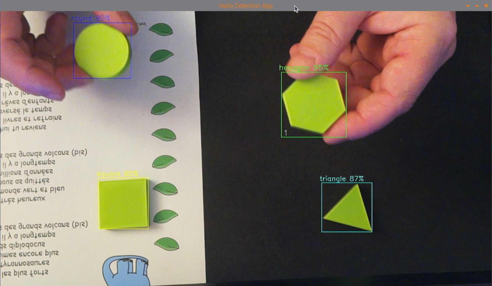
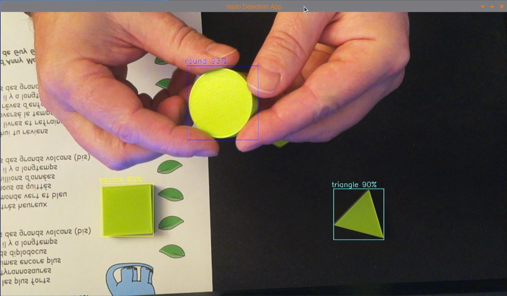
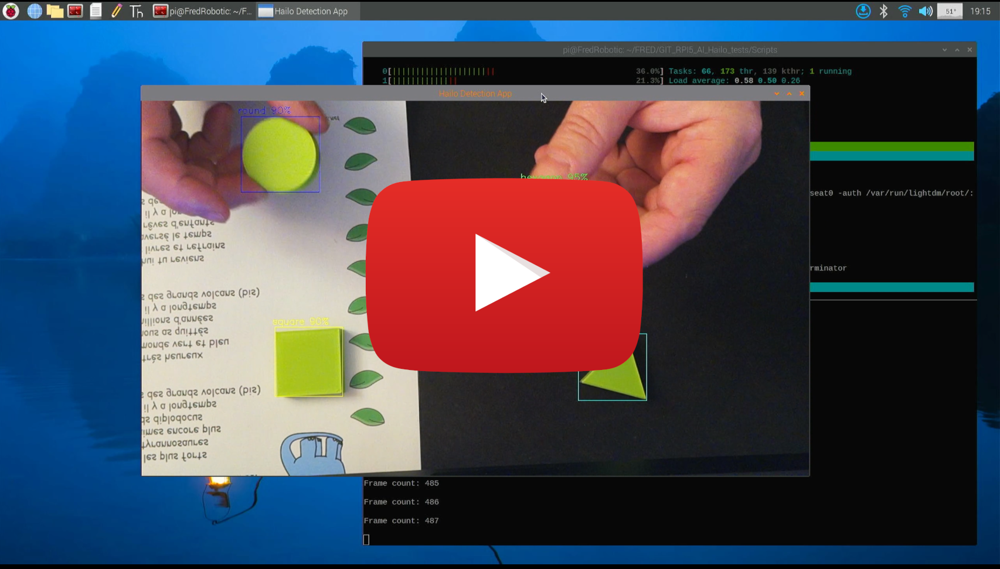

# Créer et Entraîner son propre IA pour le module AI HAILO du Raspberry PI5

Je vous propose de partager mon retour d’expérience sur la mise en œuvre d'une intelligence artificielle avec le nouveau module HAILO 8 (ou HAILO 8L) intégré dans un Raspberry PI5, capable de reconnaître et différencier divers objets personnels.

Le principe repose sur l'entraînement automatique d'un réseau de neurones, en utilisant les outils YOLO et le compilateur HAILO, à partir d'un ensemble de données constitué d'un certain nombre d'images (le "DataSet").

Ce réseau de neurones sera ensuite capable d'identifier, avec un taux de certitude donné, les objets pour lesquels il a été entraîné, que ce soit sur des images statiques ou sur un flux vidéo.
         
   

## Au sommaire :

1. [Introduction](1_intro.md)

    1.1 le "kit AI" 
    1.2 le compilateur Hailo DFC 
    1.3 la caméra AI 
    1.4 le Raspberry Pi AI HAT+ 
    1.5 d'autres solutions AI 

2. [Configuration et tests rapides du module AI HAILO](2_config_et_tests.md)

    2.1 Premier configuration 
    2.2 Vérification de la présence du module AI 
    2.3 Vérification de la présence de la (ou des) caméra(s) RPI 
    2.4 Tests de Détection, Segmentation, Estimation   
    

3. Créer et Entraîner son propre IA pour le module AI HAILO du Raspberry PI5

    3.1 [Création de son jeu de donnée](3_1_creation_du_Dataset.md) 
    - 3.1.1 Création du Dataset en local 
    - 3.1.2 Création du Dataset sur le cloud 

    3.2 [Entraînement du modèle de notre IA](3_2_entrainement_du_modele.md) 
    3.3 [Conversion du modèle pour le module HAILO](3_3_conversion_du_modele.md) 
    3.4 [Déploiement et tests sur le Raspberry PI5](3_4_deploiement_du_modele.md) 
    3.5 [Conclusion](3_5_conclusion.md) 

4. Conclusion (*TODO*) 

---

https://youtu.be/b6qGFZ387_Y
 

---