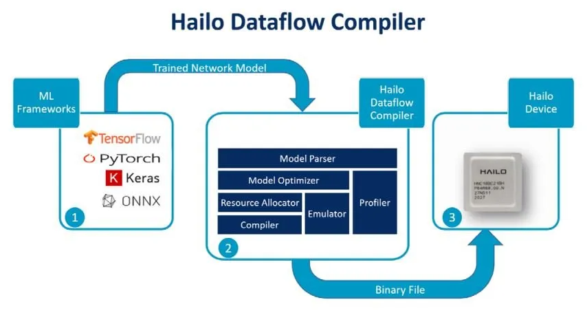
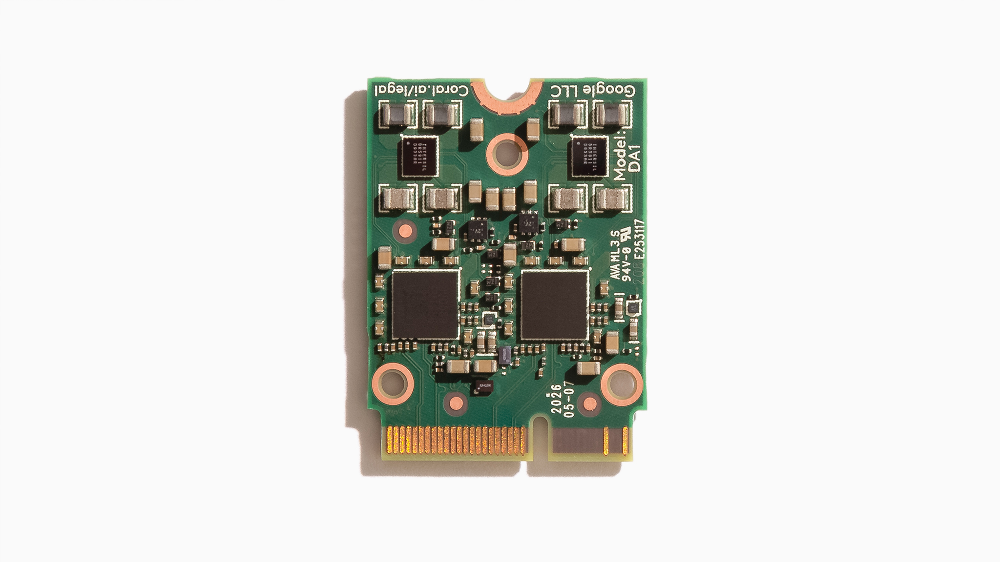

# Partie 1 - Introduction

## Voici une rétrospective des modules IA pour Raspberry PI

L'année 2024 fut marquée, particulièrement pour nos chères cartes Raspberry PI, par l'arrivé de multiples modules AI officiels.

Ces modules, proposés par la fondation Raspberry, sont capables de réaliser les traitements requis par l’utilisation de réseaux de neurones de l'IA que l'on souhaite mettre en œuvre;
comme le ferait un GPU  (Graphics Processing Unit) dans une grosse machine ... 
et ainsi, réduire considérablement les sollicitations du microprocesseur principal (CPU) .   

En pratique, les modules accélérateur d'IA permettent de créer des applications complexes de traitement vidéo en temps réel, 
ou de "vision intelligente par ordinateur", avec une très faible latence, même sur des ordinateurs de taille modeste !
les domaines d'application sont très nombreux ! on peut citer par exemple : la détection d'objets, la détection de personne, de visage, 
la segmentation d'image, la classification, la détection de pose, le suivi (ou tracking).

---
  
## 1.1 le "kit AI" - juin 2024

Ce kit est composé d'une carte d’extension au format Raspberry disposant d'un connecteur M2 , la carte **M2 HAT.+** 
Le connecteur M2 utilise le bus PCIe 3.0 à une vitesse de 8Gbit/s et peut éventuellement accueillir un disque SSD, 
mais dans le cadre de notre Kit, le connecteur accueille un module accélérateur d'IA **Hailo-8L**. 
Le puce accélératrice  Hailo-8L est capable de réaliser 13 Téra-opérations par seconde (13 TOPS) et est évidement compatible avec les module caméra du RPI.  
Le kit est accompagné d'une suite logiciel permettant de faire ses premiers pas autour des libs rpicam-apps ( on en parle plus bas )

---

## 1.2 le compilateur Hailo DFC - juillet 2024

Très rapidement, le mois suivant, Hailo annonce la sorti de son compilateur Dataflow (DFC) qui permet de personnaliser le réseau de neurone selon ses besoins.  
Un conteneur Docker est proposé pour faciliter l'installation.

_2 méthodes sont proposées :_

* **Bring Your Own Data (BYOD)** - Apportez vos propres données 
   qui consiste à "recycler" un modèle déjà entraîné, mais cette fois ci avec son propre jeu de données. 
	https://github.com/hailo-ai/hailo-rpi5-examples/blob/main/doc/retraining-example.md 
* **Bring Your Own Model (BYOM)** - "Apportez votre propre modèle" 
	qui nécessite une compréhension plus approfondie du modèle de données et du flux de conversion (le "workflow") vers le format HEF des modules Hailo. 
	Documentation complète ici : 
	https://hailo.ai/developer-zone/documentation/dataflow-compiler/latest 
	

---

## 1.3 la caméra AI - septembre 2024 

Là où le Kit AI Hailo est uniquement compatible avec la carte PI 5 , la caméra officielle Raspberry AI est utilisable sur l'ensemble de la gamme des cartes, y compris la Raspberry PI Zero. 
Cette caméra embarque un capteur Sony IMX500 de 12 millions de pixel avec une vision à 78 degrés et également le mico-contrôleur RP2040 ( oui ! le même que sur sur le Raspberry PICO !) pour la gestion du réseau de neurone et du firmware. 

La suite logiciel d'IA de Sony permet de mettre en œuvre les réseaux de neurones de type TensorFlow ou PyTorch après conversion et chargement dans la flash de la caméra.

_Pour bien démarrer :_ 
> https://www.raspberrypi.com/documentation/accessories/ai-camera.html 
> https://github.com/raspberrypi/imx500-models 

---

## 1.4 le Raspberry Pi AI HAT+ - septembre 2024 

Cette fois ci, l'accélérateur Hailo AI n'est plus au format d'une carte M2 ! 
C'est bien une carte d’extension pour Raspberry PI5 : un module HAT, en deux versions : 
* le modèle 13 TOPS (téra-opérations par seconde), doté du même accélérateur Hailo-8L que le kit AI
* le modèle 26 TOPS, plus puissant ! équipé de l’accélérateur Hailo-8

Toujours raccordé au bus PCIe Gen 3.0

https://www.raspberrypi.com/products/ai-hat/

---

## 1.5 d'autres solutions AI 

Une autre solution, mais moins officielle, consiste à utiliser une carte d’extension de type **Hat uPCIty Lite** pour disposer d'un bus PCIe x4  sur son Raspberry PI. 

Ce Bus PCIe x4  permet en suite de connecter une carte de type **Alftel 12x PCI Express M.2 Carrier Board** ... qui dispose de **12 slots PCI Express M2 !!!**  

Nous pourions donc installer 12 modules Hailo-8L au format M2 !!!  

  

  

https://youtu.be/oFNKfMCGiqE

Mais puisque nous disposons d'un bus PCIe x4, il serait donc possible de plugger directement une carte graphique (GPU) type RTX xxxx sur le Hat uPCIty Lite  ... !!!   
**Ok ! cette solution reste plutôt expérimentale ...!!** 

A noter également qu'il existe d'autres modules AI, comme par exemple le module Accélérateur Google Coral M.2 (A+E). 
Une solution économique doté du processeur Google Edge TPU capable d'atteindre une performance de 4 tera-opérations par seconde. 

 
...mais nous nous éloignons un peu de notre sujet ! 

---

