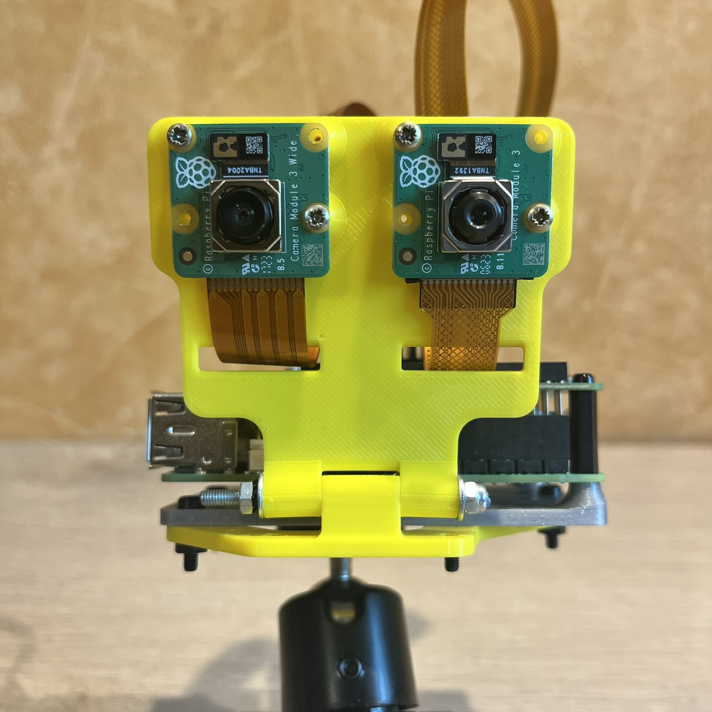
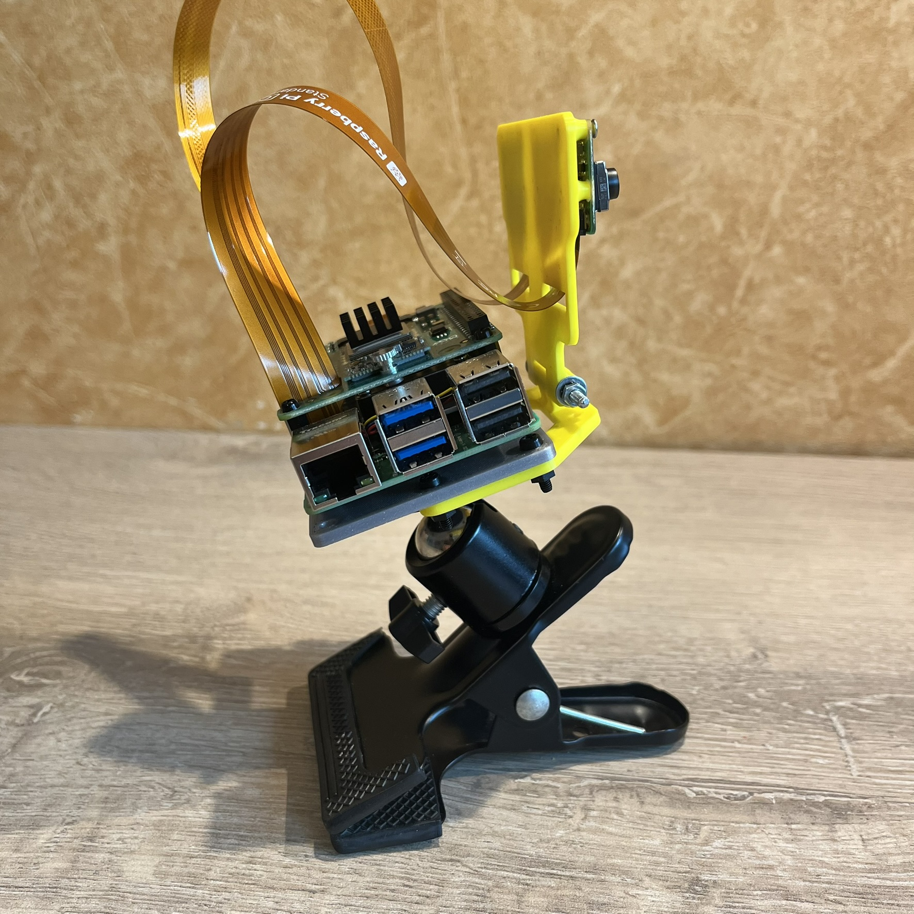

# Partie 2 - Configuration rapide et tests des modules AI

## 2.1 Premiere configuration 

Bon ! 
Pour bien démarrer, la première chose à faire est de suivre les instructions d'installation hardware et software sur le site officiel.

ici --> https://www.raspberrypi.com/documentation/accessories/ai-hat-plus.html<br>
et ici -->  https://www.raspberrypi.com/documentation/computers/ai.html

_Pour résumer très rapidement, voici les principales étapes de configuration :_

Mise à jour du système PI OS :

```bash
sudo apt update && sudo apt full-upgrade -y && sudo apt autoremove -y
```

Vérification de la version du micrologiciel (bootloader) du Raspberry Pi :
```bash
sudo rpi-eeprom-update 
```

pour utiliser la dernière version du bootloader : 
```bash
sudo raspi-config

		--> Advanced Options --> Bootloader Version --> Latest
		--> Finish  --> MAIS ne pas rebooter tout de suite ! 
```

mise à jour du micrologiciel (bootloader) du Raspberry Pi & reboot :
		
```bash
sudo rpi-eeprom-update -a 
sudo reboot 
```
	
en suite , pour forcer les vitesses Gen 3.0 (8 GT/s) du bus PCIe :<br>	
dans ```/boot/firmware/config.txt```
	
```bash
	dtparam=pciex1_gen=3
```

et enfin, installation des pilotes et utilitaires HAILO :

```bash
sudo apt install hailo-all 		
```

ce package à pour rôle d'installer les dépendances suivantes (janv2025):

```bash
	hailofw (>= 4.19.0), 
	hailort (>= 4.19.0), 
	hailo-tappas-core (>= 3.30.0), 
	rpicam-apps-hailo-postprocess (>= 1.5.3), 
	python3-hailort (>= 4.19.0)
```
	
Il est temps maintenant, de faire quelques vérifications
	
	
## 2.2 Vérification de la présence du module AI

pour le Kit AI équipé du module **HAILO 8L** : 

```bash
$ hailortcli fw-control identify
	
		Executing on device: 0000:01:00.0
		Identifying board
		Control Protocol Version: 2
		Firmware Version: 4.19.0 (release,app,extended context switch buffer)
		Logger Version: 0
		Board Name: Hailo-8
		Device Architecture: HAILO8L
		Serial Number: HLDDLBB241602841
		Part Number: HM21LB1C2LAE
		Product Name: HAILO-8L AI ACC M.2 B+M KEY MODULE EXT TMP
```
ou, celon le cas,<br>
pour la carte AI Hat+ équipée du module **HAILO 8** : 
```bash
$ hailortcli fw-control identify

		Executing on device: 0000:01:00.0
		Identifying board
		Control Protocol Version: 2
		Firmware Version: 4.19.0 (release,app,extended context switch buffer)
		Logger Version: 0
		Board Name: Hailo-8
		Device Architecture: HAILO8
		Serial Number: <N/A>
		Part Number: <N/A>
		Product Name: <N/A>
```

## 2.3 Vérification de la présence de la (ou des) camera(s) RPI

<a href="photos/IMG_3762.JPEG"></a> <a href="photos/IMG_3764.JPEG"></a> <a href="photos/IMG_3760.JPEG"></a>


Comme on peut le voir sur ces photos, j'ai équipé mon Raspberry PI de 2 cameras.<br>
Ceux sont deux cameras **module 3** équipées du capteur Quad Bayer IMX708 12MP.<br>
l'une en version standard avec un vision à 75 degrès,<br>
l'autre en version grand angle de 120 degrès<br>

```bash
$ rpicam-hello --list-camera

		Available cameras
		-----------------
		0 : imx708 [4608x2592 10-bit RGGB] (/base/axi/pcie@120000/rp1/i2c@88000/imx708@1a)
			Modes: 'SRGGB10_CSI2P' : 1536x864 [120.13 fps - (768, 432)/3072x1728 crop]
									 2304x1296 [56.03 fps - (0, 0)/4608x2592 crop]
									 4608x2592 [14.35 fps - (0, 0)/4608x2592 crop]

		1 : imx708_wide [4608x2592 10-bit RGGB] (/base/axi/pcie@120000/rp1/i2c@80000/imx708@1a)
			Modes: 'SRGGB10_CSI2P' : 1536x864 [120.13 fps - (768, 432)/3072x1728 crop]
									 2304x1296 [56.03 fps - (0, 0)/4608x2592 crop]
									 4608x2592 [14.35 fps - (0, 0)/4608x2592 crop]

```

Il est maintenant possible de tester, très simplement, le bon fonctionnement de la caméra : 

```bash
rpicam-hello -t 10s
``` 

Cette commande affiche l'image de vidéo de la première caméra durant 10 secondes, 
il bien évidement possible de sélectionner la caméra par son numéro d'index 

```bash
rpicam-hello -t 10s
```

```bash
rpicam-hello -t 10s --camera 0
rpicam-hello -t 10s --camera 1
```


## 2.4 Tests de Détection, Segmentation, Estimation

la commande "**rpicam-hello**", complétée par la suite d'application "**rpicam-apps**" permettent de mettre rapidement mettre en œuvre la détection d'objets, la segmentation d'images , l'estimation de pose 

```bash
apt install rpicam-apps
	
rpicam-hello -t 0 --camera 1 --post-process-file /usr/share/rpi-camera-assets/hailo_yolov8_inference.json
```

<div style="text-align:center"></div>


D'autres tests sont décrits dans la documentation officielle du Raspberry PI :<br>
--> https://www.raspberrypi.com/documentation/computers/ai.html

---

Pour maintenant aller un peu plus loin,<br>
nous pouvons tester les exemples proposés par la société HAILO :

```bash
	git clone https://github.com/hailo-ai/hailo-rpi5-examples.git
	cd hailo-rpi5-examples
	./install.sh

	source setup_env.sh
```
puis, pour lancer l'exemple sur un vidéo :

```bash
python basic_pipelines/detection.py
```
ou, pour tester de puis la camera  :
```bash
	$ python basic_pipelines/detection.py --input rpi
```
		
_Références :_ 

https://github.com/hailo-ai/hailo-rpi5-examples<br>
https://github.com/hailo-ai/hailo-rpi5-examples/blob/main/README.md#installation<br>
	

