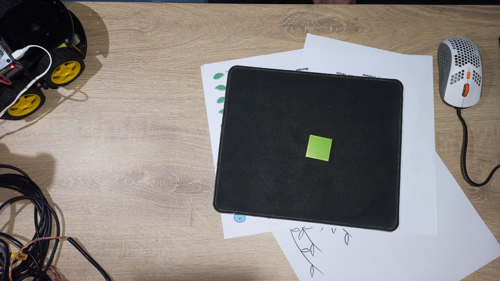
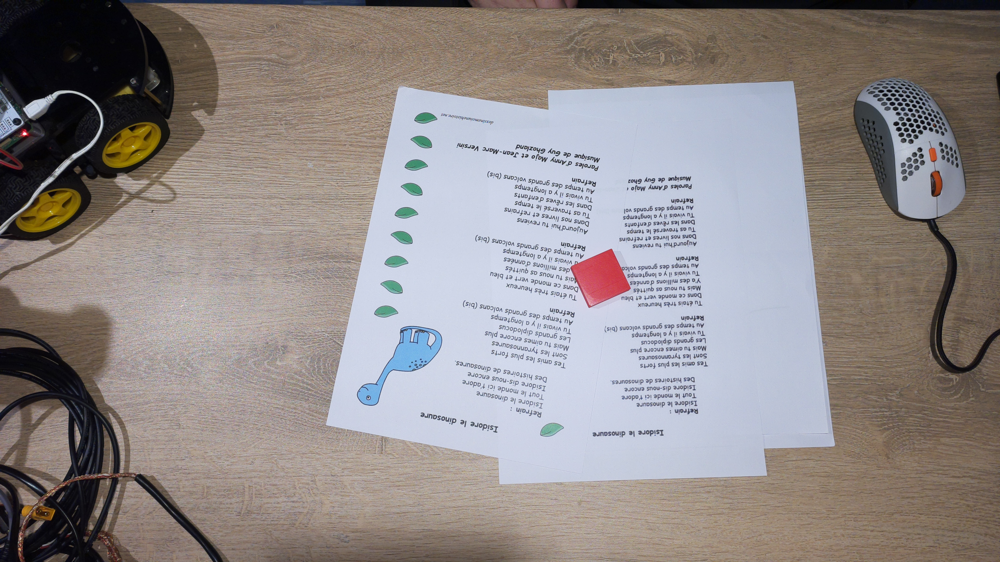
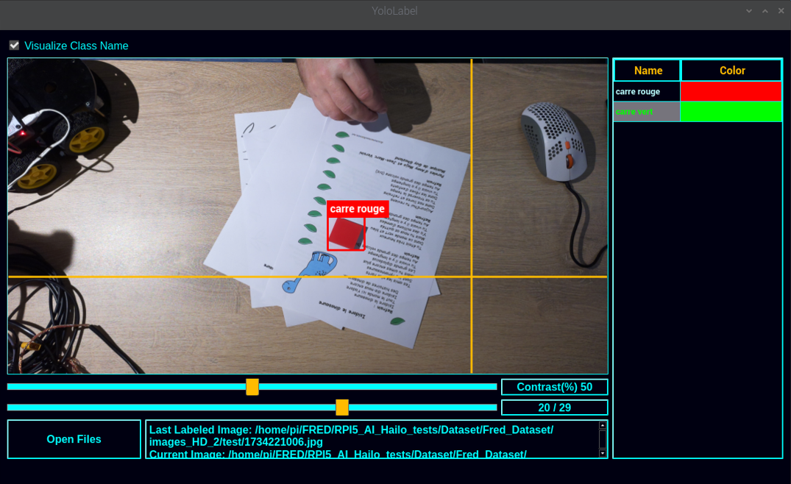
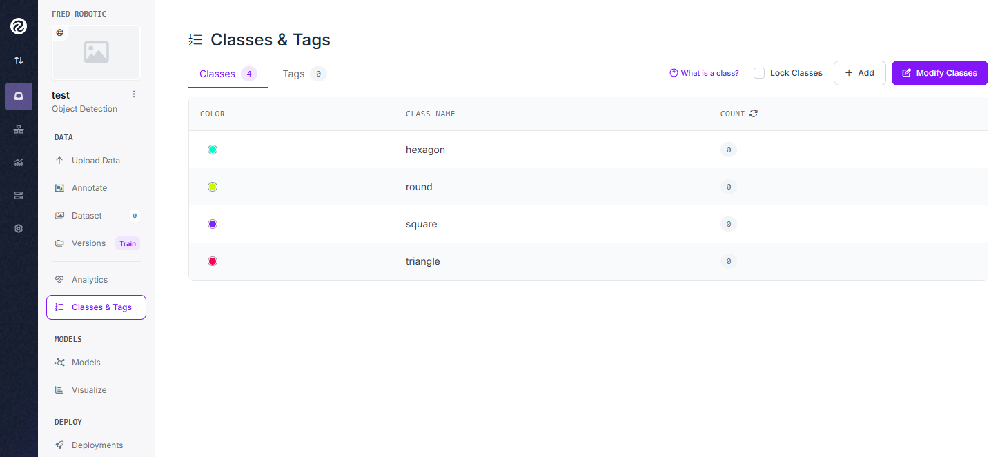
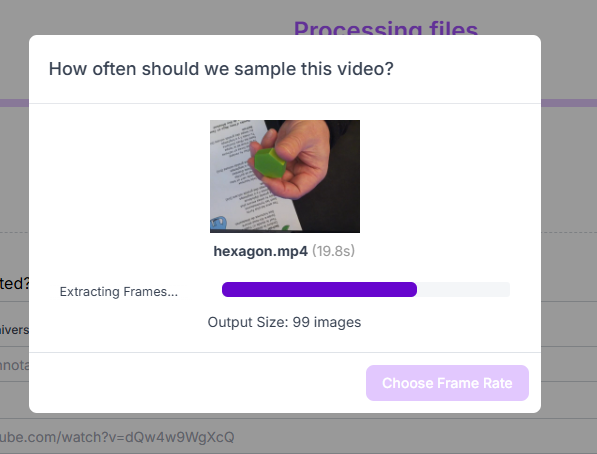
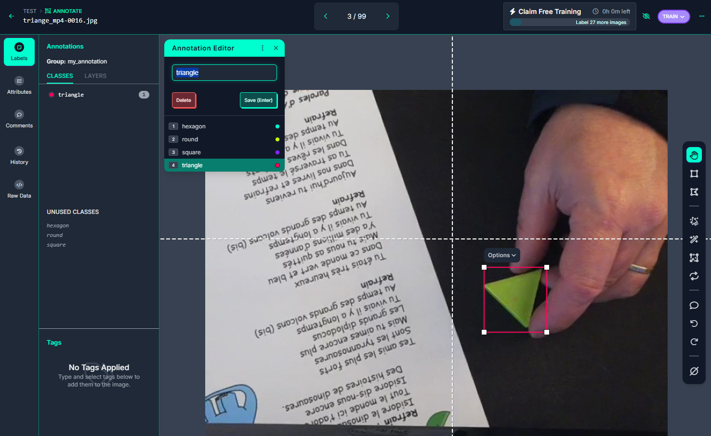
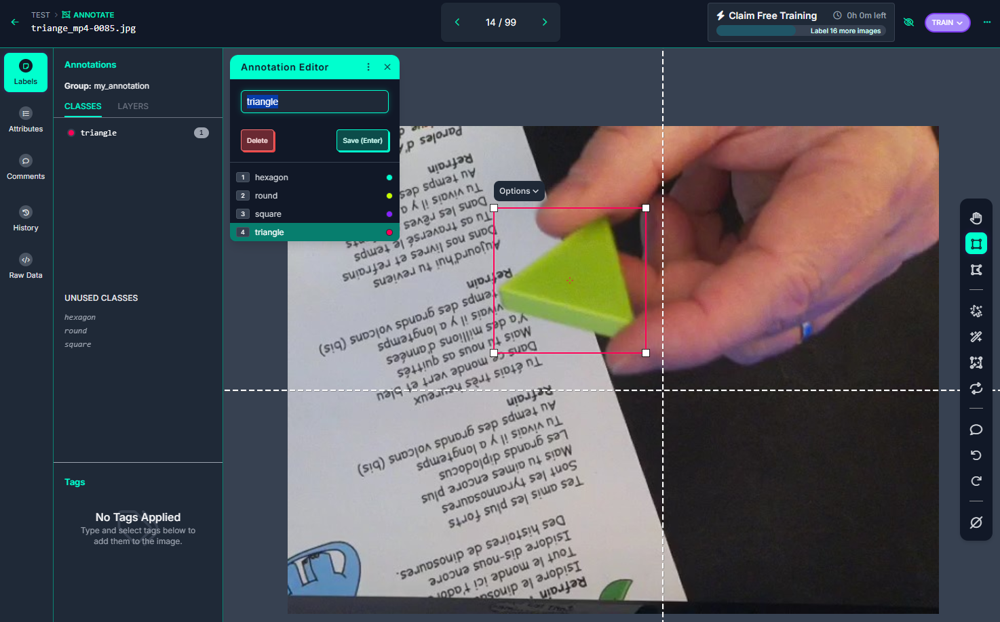
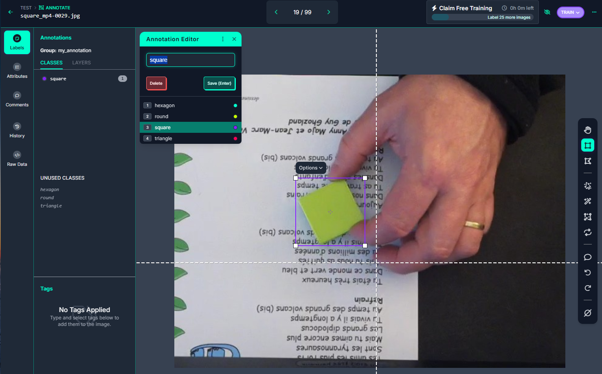
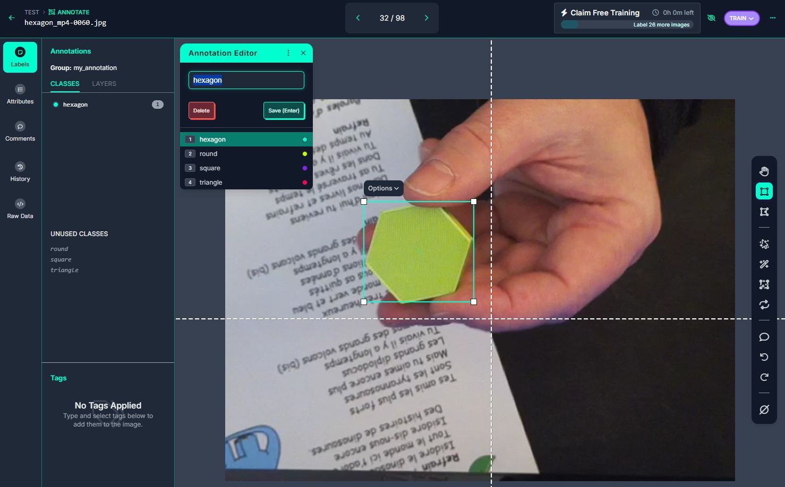
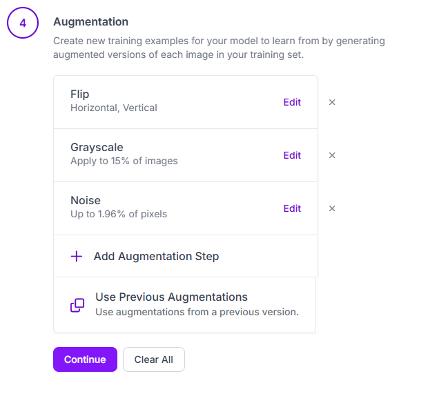

Après notre petite introduction en partie 1 et la configuration du Raspberry PI en parti 2,<br>
Il est temps de rentrer dans le vif du sujet  !!!<br>

### Partie 3 
# Créer et entraîner son propre IA pour le module HAILO du Raspberry PI5

L'objectif est donc de :

* créer une IA de reconnaissance de formes simples
* sur la base de ses propres photos ( ou vidéos )
* et qui puisse exploiter la puissance d'un module IA d'un Raspberry PI5


Nous pouvons distinguer 4 grandes étapes décrites plus bas : 

1. [la création de son jeu de données : le dataset](3_1_creation_du_Dataset.md)
2. [l’entraînement du modèle IA avec YOLOv8](3_2_entrainement_du_modele.md)
3. [la conversion, ou compilation, du modèle pour le module HAILO](3_3_conversion_du_modele.md)
4. [le déploiement et les tests sur le Raspberry PI](3_4_deploiement_du_modele/md)


_Archive du projet :_<br>
Vous pouvez retrouver les images et vidéos sources, ainsi que certains résultats des test et quelques scripts sur le dépôt GitHub suivant :<br>
https://github.com/FredJ21/RPI5_AI_Hailo_tests


---

## 3.1 - Création de son jeu de donnée

Pour la création du Dataset, plusieurs méthodes se présentent à nous : 
 
1. Tout réaliser en local à l'aide d'outils spécifiques et/ou scripts Python 
2. Utiliser une plateforme spécialisée, en ligne, dans le cloud 

J'ai commencé, dans un premier temps, par réaliser mon jeu de donnée en local,<br>
pour ensuite réaliser des versions plus complexes et certainement efficaces sur *Roboflow*,
une plateforme particulière intéressante pour notre besoin.<br>
Je vais donc décrire ces deux approches.


La création du dataset consiste à créer une collection d'images représentatives des objets que l'on souhaite détecter.<br> 
Ces images devront être annotés avec l'emplacement et le nom de l'objet visible.<br>

### Mais il y a quelques éléments à prendre en considération :

* le format du dataset : YOLOv8

YOLOv8 (You Only Look Once v8) est une version avancée de la célèbre famille de modèles YOLO 
utilisée pour la détection d’objets, la segmentation d’images et la classification. 

YOLOv8 est principalement un modèle d'IA de détection d'objets qui utilise un format spécifique pour les datasets.<br>
Ce modèle d'IA est particulièrement adapté et préconisé pour le module HAILO du Raspberry PI.


### Autres éléments importants :

- YOLOv8, comme ses prédécesseurs, fonctionne mieux avec des images carrées.
- les images doivent avoir une dimension de 640x640 pixels (par défaut pour YOLOv8) 
   --> Un bon compromis entre précision et performance. 

- l’arborescence des répertoires 
- le format des fichiers d'annotation 
- le nombre de classes
- le nommage des classes ( ex: "carré vert", "rond rouge", triangle "jaune", .... )


Voici un exemple d’organisation du dataset au format YOLOv8 :

```
	Mon_Dataset/
	├── data.yaml
	├── test
	│   ├── images
	│   └── labels
	├── train
	│   ├── images
	│   └── labels
	└── valid
		├── images
		└── labels
```

On y trouve : 

- le fichier *"data.yaml"* qui contient la liste des sous répertoires, le nombre et le nom des classes
- 3 répertoires : *"train", "valid", "test"*
- contenant chacun 2 sous répertoires : *"images" et "labels"* 

Le fichier label, au format texte (.txt) est donc stocké dans un répertoire différent de l'image correspondante,<br>
mais le lien entre ces deux fichiers est fait par leur nom ( mon_image_12345.jpg --> mon_image_12345.txt )

Enfin, les données doivent être répartis selon un certain ratio : 

* 70 % pour le training --> rep *"train"*
* 15 % pour la validation --> rep *"valid"*
* 15 % pour les tests --> rep *"test"*

Nous pourrions également envisager un répartition de 70/20/10 , ou 75/15/10 .... à tester ...

---

## 3.1.1 Création du Dataset en local 

J'ai réalisé de nombreux tests de création de dataset, avec 12 objets différents (12 classes),
différents fonds, plusieurs types d'éclairage ...  mais ça commençait à se compliquer un peu ... 
surtout quand le résultat attendu n'était pas vraiment au rendez vous .... 

J'ai donc réduit la voilure avec Dataset est composé de 2 classes  :  "carré vert"  & "carré rouge"<br>


Les fichiers sources, de mon derniers tests, son disponibles dans mon repo GitHub :
https://github.com/FredJ21/RPI5_AI_Hailo_tests


```bash
git clone https://github.com/FredJ21/RPI5_AI_Hailo_tests
cd RPI5_AI_Hailo_tests

ls -al Dataset/Fred_Dataset/images_HD_2

```

----

### Les photos :

J'ai donc fait plein de photos de mes pièces en veillant, bien évidemment, à réaliser autant de photos pour chacune d'entre elle : 

- 75 photos pour le training  dans le répertoire *"train"* (*)
- 15 photos pour la validation dans le répertoire *"valid"* (*)
- 15 photos pour les tests dans le répertoire *"test"* (*)

**( pour chaque classe d'objet !!! )*

Pour réaliser ces photos, c'est très simple !  il suffit d'utiliser la caméra du Raspberry PI ! <br>
Avec la commande suivante : 

```bash
rpicam-jpeg  --camera ${CAMERA} --output ${FILE} --timeout ${TIMEOUT} --autofocus-mode manual --lens-position 0.0
```
Cela produit une image haute définition de 4608x2592 pixels et d'environ 3,3 Mo.

<a href="img/1734219226.jpg"></a>
<a href="img/1734220832.jpg"></a>
<a href="img/1734220572.jpg"></a>
<a href="img/1734219623.jpg"></a>

Le script **"prendre_une_photo.sh"** ( dans le répertoire [GIT]Scripts/bin ) permet d'automatiser la séance !<br>
en prenant une photo toutes les 2 secondes et en répartissant les clichés des les répertoires : train, valid, et test.<br>
Le nom des fichiers correspond à un horodatage de type timestamp. 

```bash
ls -al Dataset/Fred_Dataset/images_HD_2/test/*jpg

-rw-r--r-- 1 pi pi 2994083 15 déc.  00:47 Dataset/Fred_Dataset/images_HD_2/test/1734220016.jpg
-rw-r--r-- 1 pi pi 3009538 15 déc.  00:47 Dataset/Fred_Dataset/images_HD_2/test/1734220032.jpg
-rw-r--r-- 1 pi pi 3367522 15 déc.  00:47 Dataset/Fred_Dataset/images_HD_2/test/1734220038.jpg
-rw-r--r-- 1 pi pi 3281630 15 déc.  00:47 Dataset/Fred_Dataset/images_HD_2/test/1734220046.jpg
-rw-r--r-- 1 pi pi 3273484 15 déc.  00:47 Dataset/Fred_Dataset/images_HD_2/test/1734220051.jpg
../..
```

----

### Les labels :

Il est temps maintenant d'annoter les images.<br>

Cette opération d'étiquetage consiste à dessiner un cadre de délimitation autour des objets présents sur les photos, tout en précisant sa classe ( "carré vert" ou "carré rouge" ) ?<br>

Cette opération nécessite une certaine précision et un peu de patience !!!<br>
Le cadres doit être serré mais pas trop proche.<br>
Il ne doit pas y avoir de sur ajustement dans le cas ou plusieurs objets sont présents sur la même photo.<br>
*( mais par soucis de simplification, mes images ne comportent qu'un seul objet )*

Dans mon cas, j'ai choisi de réaliser des photos distinctes par type d'objet. J'ai donc qu'un seul objet par photo. 

Je souhaitais également réaliser cette opération complètement en local, sur mon Raspberry PI5, à l'aide d'un utilitaire très léger.<br>
J'ai utilisé **"YOLO-Label"** que l'on peut trouver ici : https://github.com/developer0hye/Yolo_Label

"YOLO-Label" est également disponible dans une version pré-compilé pour le Raspberry PI 64bits (version Debian/PiOS 12 bookworm) sur mon GIT :  

```bash
cd RPI5_AI_Hailo_tests//Scripts/bin/Yolo_Label/
chmod +x YoloLabel
./YoloLabel
```


*(animation d'exemple du site officiel)*


L'utilisation est très simple et doit être réalisé sur l'ensemble des photos de DataSet.<br>
- on sélectionne le répertoire de travail qui contient les images
- on sélectionne la liste des classes ( *labels_list.txt* )
- on choisit une classe 
- on dessine en carré pour délimiter notre pièce 
- next ... 

</a>
</a>

Tous les fichiers jpeg sont maintenant accompagnés par un fichier texte du même nom mais avec l’extension .txt .   

	1734219226.jpg	-->  1734219226.txt
	1734220832.jpg  -->  1734220832.txt
	1734220572.jpg  -->  1734220572.txt
	1734219623.jpg  -->  1734219623.txt

Ces fichiers contiennent 5 valeurs numérique :

```bash
$ cat train/1734219226.txt 

1 0.637242 0.526384 0.053579 0.094291
```

* l'index de la classe d'objet (0->carré route, 1->carré vert) et les 
* la position en X du centre de l’objet
* la position en Y du centre de l’objet
* la largeur de l’objet 
* la hauteur de l’objet

Les coordonnées sont normalisées de 0 à 1

----

####  Augmentation du nombre d'image

Nous avons donc, pour l'ensemble de nos objets : 
- 150 photos d'entraînement, 
- 30 photos de validation, 
- 30 photos de test,
- les photos sont au format .jpg et d'une dimension de 4608x2592 pixels,
- chaque photo est accompagné de son fichier label au format .txt


Il maintenant nécessaire de redimensionner les photos au format 640x640 pixels (pour YOLOv8),<br>
de plus, il est intéressant d'**augmenter artificiellement** le nombre de photos !!<br>
En effet l'entraînement de l'IA sur un plus grand nombre de photos permettra d'obtenir de meilleurs résultats 


Plusieurs solutions permettent d'augmenter le nombre de photos : 

* **recadrer** l'image par rapport à l'objet en positionnant l'objet plus ou moins sur la droite ou plus ou moins sur la gauche <br>
--> cette opération permet de passer d'un format de 4608x2592 pixels  à un format carré de 640x640 pixels
* réaliser une ou plusieurs **rotation** d'image
* ajouter artificiellement du **bruit** ( des points blancs ou noirs )
* réaliser plusieurs **itérations** par image source


J'ai développé un script Python pour réaliser cela  :

```bash 
cd RPI5_AI_Hailo_tests/Scripts/

python3 -m venv --system-site-packages venv
source venv/bin/activate
pip install -r requirements.txt

cd bin

cat dataset_HD_to_640x640.conf

	{
		"REP_IN"  : "../../Dataset/Fred_Dataset/images_HD_2",
		"REP_OUT" : "/home/pi/My_Dataset/",
		"IMG_FILE_EXT"   : ".jpg",
		"LABEL_FILE_EXT" : ".txt",
		"Nb_Iteration_par_image" : 15,
		"Add_Noise" : 1,
		"Retournement" : 3
	}
```

Le fichier de configuration défini les répertoires source et destination, le nombre de bruit, le nombre de retournement d'image<br>
Le script se chargera également de recalculer la nouvelle position, en x et y, de l'objet et ses dimensions afin de produire un nouveau fichier label.<br>    
Le répertoire cible (REP_OUT) n'est pas obligé d'exister, le script se chargera de créer toute l’arborescence de répertoires.

## *GO !!!* 


```bash 

python dataset_HD_to_640x640.py

```

Puisque nous avons réalisé 15 itérations, pour lesquels nous avons une version avec et sans bruit, et 3 retournements en plus de la position de départ    

- 150 * 15 * 2 * 4 --> 18000 photos le répertoire *"train"* 
- 30 * 15 * 2 * 4 --> 3600 photos dans le répertoire *"valid"* 
- 30 * 15 * 2 * 4 --> 3600 photos dans le répertoire *"test"*

cd qui donne un total de 25200 photos accompagnées de leurs annotations !<br>
en effet : 

```bash
find /home/pi/My_Dataset -name *jpg | wc -l

	25200
```
</a>

### **Notre Dataset est prêt à être utilisé pour l'apprentissage  !!!**

... mais il est également possible de créer son jeu de données en ligue, dans le cloud 

---


## 3.1.2 Création du Dataset sur Roboflow

Une autre solution pour réaliser son dataset et l'annotation de ses images, est d'utiliser un outil en ligne.<br>

**Roboflow** ( https://roboflow.com/ ) est une plateforme tout-en-un qui facilite la gestion, l'annotation, l'augmentation et l'exportation de datasets pour l'entraînement de modèles de vision par ordinateur. Elle est particulièrement utile pour des modèles comme YOLOv8, Faster R-CNN, SSD, et d'autres.

On peut identifier plusieurs fonctionnalités très intéressantes :  

* Annotation d’images : Interface web collaborative pour annoter rapidement les objets.
* Augmentation des données : Ajout automatique de variations (rotation, flou, contraste, etc.) pour améliorer la robustesse du modèle.
* Conversion de formats : Compatible avec YOLO, COCO, Pascal VOC, et d'autres standards.
* Hébergement & API : Stocke et gère les datasets, avec accès via API pour automatiser les workflows.
* Entraînement et déploiement : Intégration avec des frameworks d'IA (PyTorch, TensorFlow) et déploiement dans le cloud ou en edge computing.


Une dès première fonctionnalité très intéressante :  

* **Roboflow permet d'extraire une série de photos depuis une vidéo !!!**

### Nouveau Dataset :

Cette fois ci, pour ce nouveau Dataset, j'ai choisi un nouvel énoncé de départ :

* un Dataset avec 4 classes : round, square, triangle, hexagon
* les 4 objets sont de couleur identique ( vert )
* les images sont extraites de 4 vidéos distinctes
* chaque vidéo dure exactement de 20 secondes 


Pour réaliser les vidés, c'est très simple !  il suffit d'utiliser la camera du Raspberry PI ! <br>
Avec la commande suivante : 

```bash
	rpicam-vid --camera 0 -t20000 --autofocus-range normal --autofocus-speed fast -o square.mp4
```

Nous pouvons bien évidemment ajuster les paramètres d'autofocus et autres ... 

Ces vidéos de départ sont dans le répertoire :  *Dataset/210125_4_shapes_TEST.sources* du dépôt Git :

```bash
ls -al Dataset/210125_4_shapes_TEST.sources/

	-rw-rw-r-- 1 fredj21 fredj21 4881188 janv. 29 13:37 hexagon.mp4
	-rw-rw-r-- 1 fredj21 fredj21 4985373 janv. 29 13:37 round.mp4
	-rw-rw-r-- 1 fredj21 fredj21 4848499 janv. 29 13:37 square.mp4
	-rw-rw-r-- 1 fredj21 fredj21 5261945 janv. 29 13:37 triange.mp4
```

---

Direction donc  --> http://www.roboflow.com/  

Après s'être identifié,<br>
on crée un nouveau projet **public** de type "Object Detection" avec le nom des différentes classes

</a>

Ensuite, nous ajoutons les classes à notre projet 

* round, 
* square, 
* triangle, 
* hexagon

</a>


Maintenant, dans la section "Upload Data", nous importons chaque vidéo, l'une après l'autre<br>
avec une fréquence d’échantillonnage de **5 images par seconde** (choix arbitraire à adapter à ses besoins) <br> 

  

On crée des tâches de type  **"Manual Labeling"**,  que l'on assigne à soi même.<br>

En effet, la plateforme est collaborative, et permet d'assigner des taches à différentes personnes<br>
Dans la section "Annotate", nous pouvons visualiser les différentes taches restants, la personne en charge de cette tâche, le taux de réalisation    

<br>


Pas de difficulté lors du labeling, il faut juste veiller à sélectionner la bonne classe ....  et avoir un peu de patience !!! <br>

 
 


Après avoir annoter l'ensemble des images, nous allons ajouter ces images à notre Dataset en utilisant la méthode *"Split Images Between Train/Valid/Test"* qui permettra de répartir aléatoirement nos photos pour les besoins de training, validation et test.

<br>


Enfin, il nous reste à générer une nouvelle version de notre Dataset en appliquant des opérations de **rotation**, ajout de **bruit**, passage de certaines photos en **niveau de gris**, .... <br>

Dans la section "Dataset" --> "Generate Version"

Le but étant, ici, d'augmenter artificiellement le nombre de photos de notre Dataset<br>

<br>


### Pour résumer cette création de son jeu de données sur Roboflow:

Nous sommes parti sur la base de :
* 4 vidéos de 20 secondes 
* un échantillonnage de 5 images par seconde
* ce qui donne : **99 images par classe** 

Après l"opération de "split", nous obtenons :

* 70 %  Train			--> 69 images
* 20 %  Validation		--> 20 images	
* 10 %  Test			--> 10 images

Un total donc, pour l'ensemble des classes de  :

* 276 image de training
* 80 images de Validation
* 40 image de Test
   
Ensuite, la création d'une version du Dataset ( augmentation du nombre d'image)

* rotation horizontal et vertical
* gris 	15% des images
* bruit 1.96%

Lors de cet augmentation, nous sommes limité, dans la version gratuite de Roboflow, à 1500 images !<br>
Nous avons donc maintenant : 	

* 1380 image de training
* 80 images de Validation
* 40 image de Test

### Téléchargement du jeu de données

Nous pouvons maintenant télécharger notre Dataset dans de nombreux formats<br>
--> particulièrement au format **YOLOv8** pour la suite de notre projet ! <br>


<br>


l'ensemble des fichiers se trouve dans le répertoire :  *Dataset/210125_4_shapes_TEST.v2i.yolov8/* du dépôt Git :

```bash
ls -l Dataset/210125_4_shapes_TEST.v2i.yolov8

	-rw-rw-r-- 1 fredj21 fredj21  299 févr.  2 08:08 data.yaml
	-rw-rw-r-- 1 fredj21 fredj21  150 févr.  2 08:08 README.dataset.txt
	-rw-rw-r-- 1 fredj21 fredj21 1190 févr.  2 08:08 README.roboflow.txt
	drwxrwxr-x 4 fredj21 fredj21 4096 févr.  2 08:08 test
	drwxrwxr-x 4 fredj21 fredj21 4096 févr.  2 08:08 train
	drwxrwxr-x 4 fredj21 fredj21 4096 févr.  2 08:08 valid


tree Dataset/210125_4_shapes_TEST.v2i.yolov8 -d

	Dataset/210125_4_shapes_TEST.v2i.yolov8
	├── test
	│   ├── images
	│   └── labels
	├── train
	│   ├── images
	│   └── labels
	└── valid
		├── images
		└── labels
```

### Prêt à coder !!! 

Robotflow propose également, dans la section "Download", plusieurs méthodes d'accès au Dataset.<br>
et plus particulièrement une librairie Python pour automatiser le téléchargement de son Dataset<br>

```bash
pip install roboflow

python

	from roboflow import Roboflow
	rf = Roboflow(api_key="xxxxxxxxxxxxxxxxxxx")
	project = rf.workspace("fred-robotic").project("210125_4_shapes_test")
	version = project.version(2)
	dataset = version.download("yolov8")
```

### Prêt à entrainner notre modêle !!!