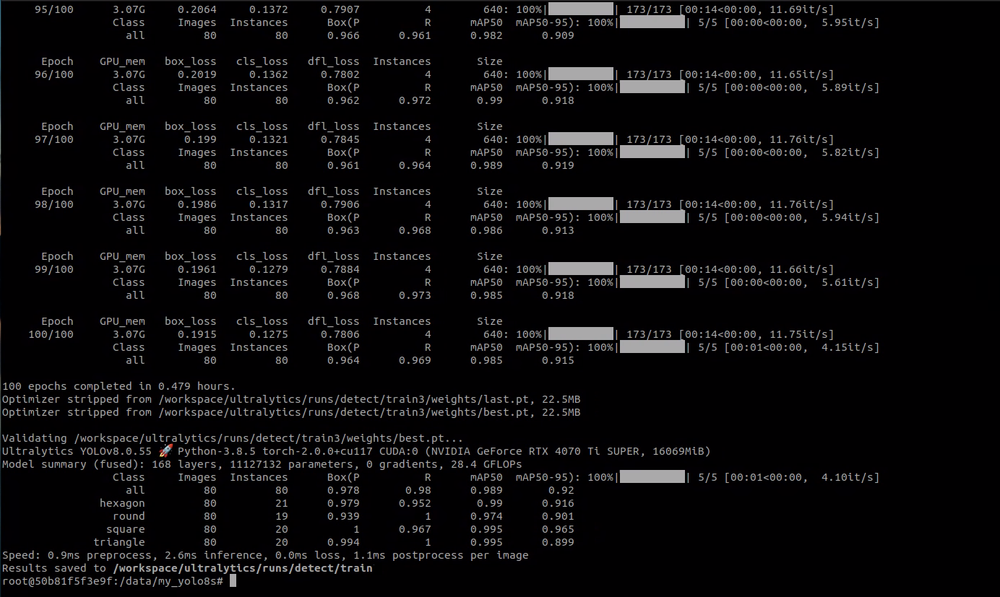
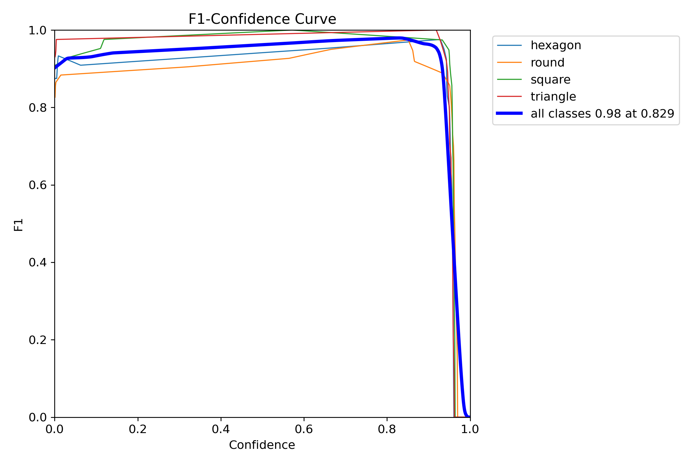
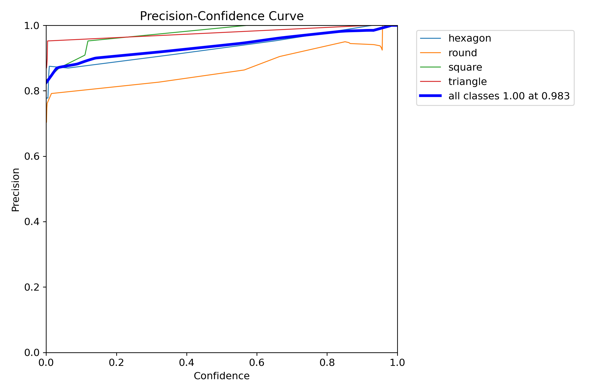
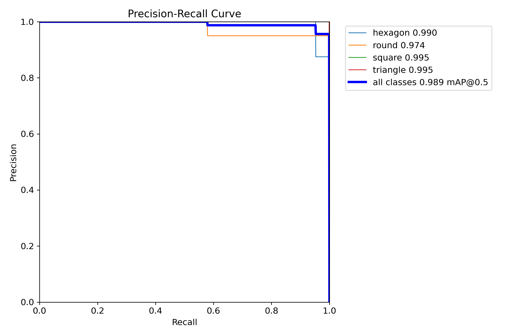
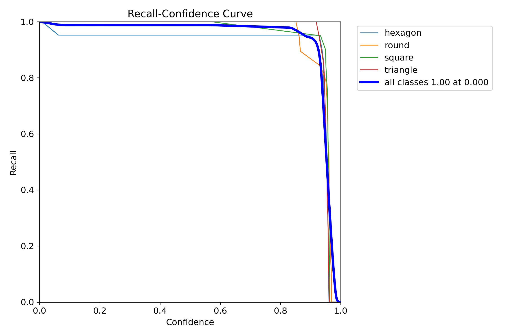
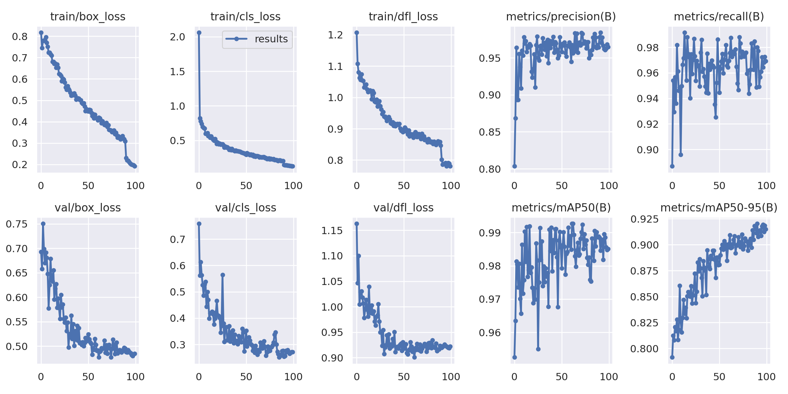
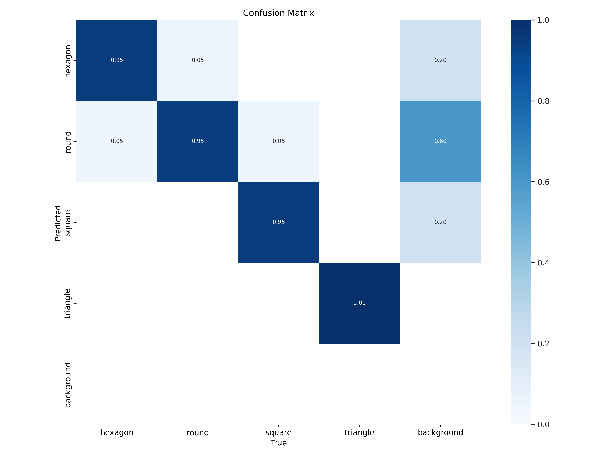
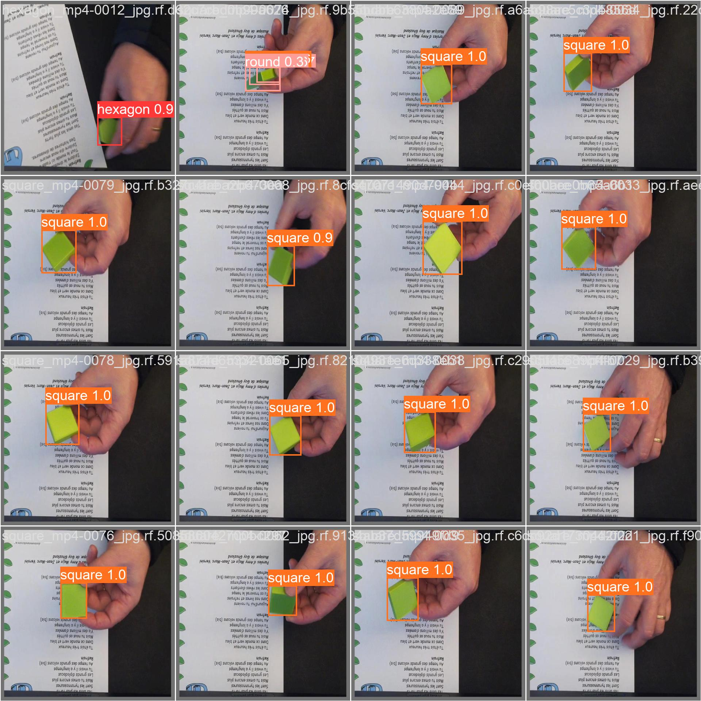
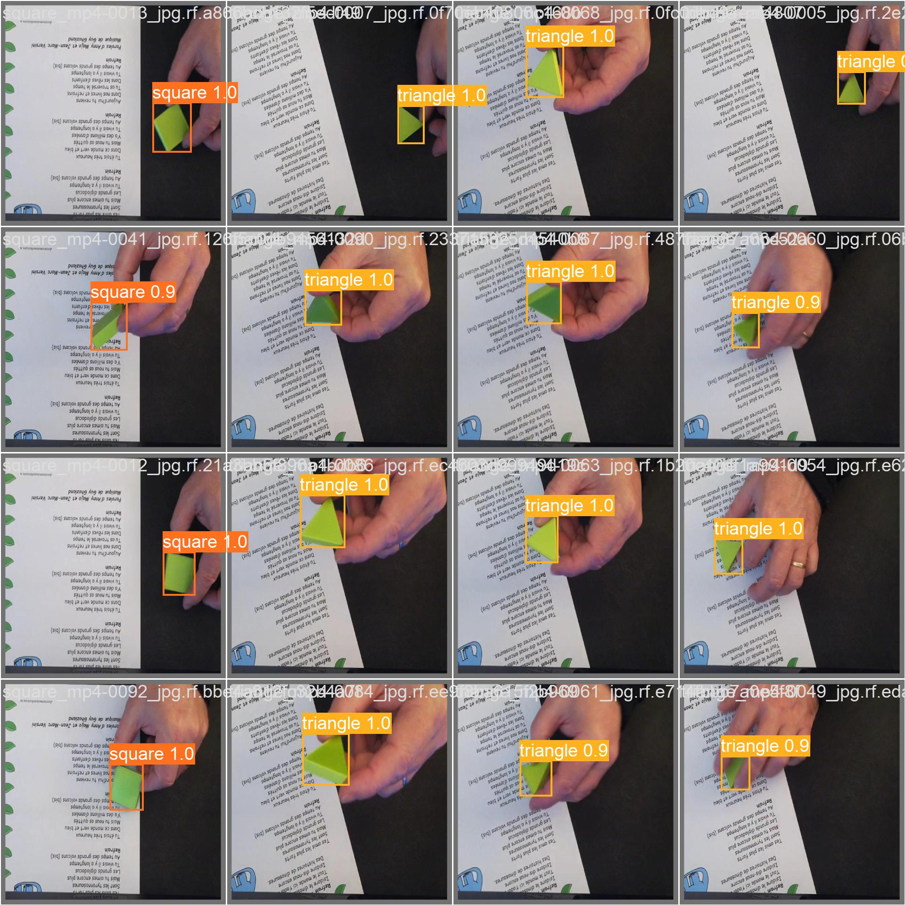
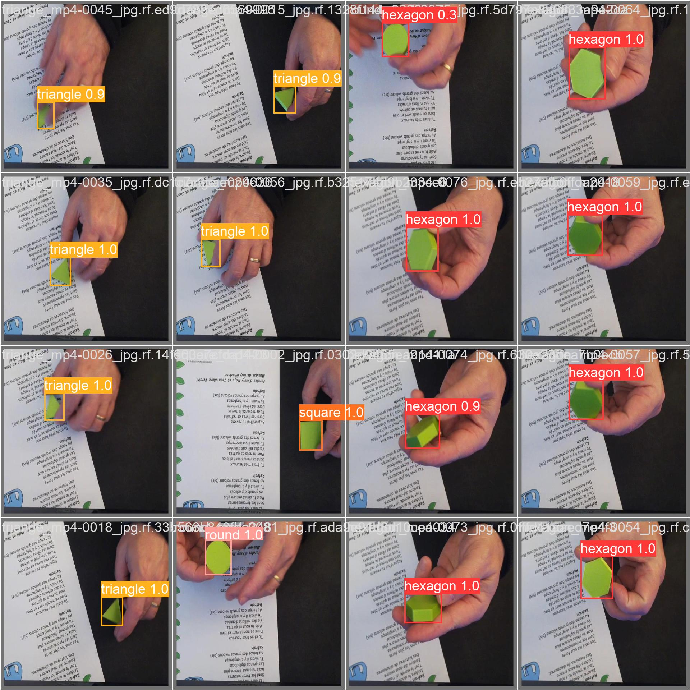

# 3.2 - Entraînement du modèle IA

Pour réaliser l'apprentissage de notre modèle, plus solutions se présente à nous  :  

* entraîner le modèle en local, **sous linux**
* ou en ligne, dans le cloud, sur Google Colab

##   Entraînement du modèle sous linux

il ne sera pas possible de réaliser cette étape directement sur un Raspberry PI 

En effet, l'entraînement de l'IA nécessite beaucoup de calculs et donc de ressources (mémoire/cpu/gpu),<br>
il est fortement recommandé d'utiliser un PC puissant équipé d'une bonne grosse carte GPU 


Cette solution est techniquement très intéressante et mais surtout très chronophage !!! car elle nécessite pas mal de configuration sous Linux pour installer l'ensemble des outils et leurs dépendances !<br>

MAIS, fort heureusement **HAILO propose des environnements pré-configurés sous forme de conteneur Docker**<br>
L'environnement Docker s'installe et s'utilise en quelques lignes :


```bash 
git clone https://github.com/hailo-ai/hailo_model_zoo.git
cd hailo_model_zoo/training/yolov8

docker build --build-arg timezone=`cat /etc/timezone` -t yolov8:v0 .

docker run --name "yolov8" -it --gpus all --ipc=host -v  /data_1:/data  yolov8:v0
```

## Dans le DOCKER YOLOv8

Nous voila dans le conteneur Docker Yolo8 !!!<br>
A noter que le répertoire ***/data*** du conteneur **est mappé** avec le répertoire ***/data_1*** de la machine Linux hôte<br>
--> cela permettra d'extraire les résultats des traitements 


Nous pouvons dans, un premier temps, vérifier détection correcte de la carte vidéo et des drivers CUDA

```bash 
$ nvidia-smi 

Sun Feb  2 15:08:44 2025       
+-----------------------------------------------------------------------------------------+
| NVIDIA-SMI 550.120                Driver Version: 550.120        CUDA Version: 12.4     |
|-----------------------------------------+------------------------+----------------------+
| GPU  Name                 Persistence-M | Bus-Id          Disp.A | Volatile Uncorr. ECC |
| Fan  Temp   Perf          Pwr:Usage/Cap |           Memory-Usage | GPU-Util  Compute M. |
|                                         |                        |               MIG M. |
|=========================================+========================+======================|
|   0  NVIDIA GeForce RTX 4070 ...    Off |   00000000:01:00.0  On |                  N/A |
|  0%   42C    P2             41W /  285W |     418MiB /  16376MiB |      0%      Default |
|                                         |                        |                  N/A |
+-----------------------------------------+------------------------+----------------------+
                                                                                         
+-----------------------------------------------------------------------------------------+
| Processes:                                                                              |
|  GPU   GI   CI        PID   Type   Process name                              GPU Memory |
|        ID   ID                                                               Usage      |
|=========================================================================================|
+-----------------------------------------------------------------------------------------+
```

Ensuite , nous allons créer 2 répertoires 
* l'un pour le Dataset
* l'autre pour les résultats des traitements  

```bash
mkdir /data/my_dataset
mkdir /data/my_yolo8s
```

## Récupération (téléchargement) de notre Dataset

Comme nous l'avons vu plus haut, il existe plusieurs méthodes pour retrouver son Dataset précédemment créé sur Robotflow<br>
Une des plus simple est la commande "curl"  :

```bash
apt install curl unzip

cd /data/my_dataset
curl -L "https://app.roboflow.com/ds/MtF5ewIPDd?key=DtuQjJYrBl" > roboflow.zip; unzip roboflow.zip; rm roboflow.zip


root@50b81f5f3e9f:/data/my_dataset# ls -l 

	-rw-r--r-- 1 root root  150 Jan 24 13:16 README.dataset.txt
	-rw-r--r-- 1 root root 1190 Jan 24 13:16 README.roboflow.txt
	-rw-r--r-- 1 root root  299 Jan 24 13:16 data.yaml
	drwxr-xr-x 4 root root 4096 Jan 24 13:16 test
	drwxr-xr-x 4 root root 4096 Jan 24 13:16 train
	drwxr-xr-x 4 root root 4096 Jan 24 13:16 valid

```

### YOLO - Entrainement 

**VOILA !!! Nous y sommes !!!**   ... nous allons maintenant lancer le traitement d'apprentissage de notre IA 

```bash
cd /data/my_yolo8s

yolo task=detect mode=train model=yolov8s.pt data=/data/my_dataset/data.yaml  epochs=100 batch=8 
```
👉 Objectif : Entraîner le modèle YOLOv8 sur notre dataset personnalisé pendant 100 époques avec une taille de batch de 8.<br>
Nous utilisons **yolov8s.pt** comme modèle de départ pour apprend à détecter les objets.



... et après un certain temps, parfois plusieurs heures .....  ( ici, un peu moins d'une heure)<br>
Notre IA est là !<br>
* les graph des données statistiques sont générés 








* le réseau de neurones que nous allons exploiter est dans fichier **best.pt**  


```bash
root@50b81f5f3e9f:/data/my_yolo8s# ls -l /workspace/ultralytics/runs/detect/train/weights/
total 43968
-rw-r--r-- 1 root root 22510584 Feb  2 15:52 best.pt
-rw-r--r-- 1 root root 22510584 Feb  2 15:52 last.pt
```

### YOLO - Validation  

```bash 
yolo task=detect mode=val model=/workspace/ultralytics/runs/detect/train/weights/best.pt data=/data/my_dataset/data.yaml
```
👉 Objectif : Tester la performance du modèle best.pt sur les images de validation définies dans data.yaml.<br>
cette étape génère des métriques (mAP, précision, rappel) pour évaluer la qualité du modèle.

*résultat :*
```bash
	Ultralytics YOLOv8.0.55 🚀 Python-3.8.5 torch-2.0.0+cu117 CUDA:0 (NVIDIA GeForce RTX 4070 Ti SUPER, 16069MiB)
	Model summary (fused): 168 layers, 11127132 parameters, 0 gradients, 28.4 GFLOPs
	val: Scanning /data/my_dataset/valid/labels.cache... 80 images, 0 backgrounds, 0 corrupt: 100%|██████████| 80/80 [00:00<?, ?it/s]
					Class     Images  Instances      Box(P          R      mAP50  mAP50-95): 100%|██████████| 5/5 [00:01<00:00,  3.80it/s]
					all         80         80      0.978       0.98      0.989      0.921
				hexagon         80         21      0.979      0.952       0.99      0.916
			 	  round         80         19      0.939          1      0.974      0.901
				 square         80         20          1      0.967      0.995      0.965
			   triangle         80         20      0.994          1      0.995      0.899
	Speed: 1.8ms preprocess, 2.8ms inference, 0.0ms loss, 0.9ms postprocess per image
	Results saved to /workspace/ultralytics/runs/detect/val
```


<br>

<br>


### YOLO - Test d'inférence

```bash 
yolo task=detect mode=predict model=/workspace/ultralytics/runs/detect/train/weights/best.pt conf=0.25 source=/data/my_dataset/test/images save=True
```

👉 Objectif : Exécuter le modèle entraîné (best.pt) sur des nouvelles images avec une confiance minimale de 0.25.<br>
Cette étape sauvegarde les résultats sous forme d'images (images annotées avec les prédictions).

*résultat :*

```bash 
Ultralytics YOLOv8.0.55 🚀 Python-3.8.5 torch-2.0.0+cu117 CUDA:0 (NVIDIA GeForce RTX 4070 Ti SUPER, 16069MiB)
Model summary (fused): 168 layers, 11127132 parameters, 0 gradients, 28.4 GFLOPs

image 1/40 ../../hexagon_mp4-0003_jpg.rf.c293d0bda8579255c22e0bb3adec7517.jpg: 640x640 1 hexagon, 6.0ms
image 2/40 ../../hexagon_mp4-0004_jpg.rf.cc7bd017125af4dbd404019b3770f394.jpg: 640x640 1 hexagon, 4.6ms
image 3/40 ../../hexagon_mp4-0008_jpg.rf.4fd6e77433c04562e72f935866ce0f6f.jpg: 640x640 1 hexagon, 4.5ms
image 4/40 ../../hexagon_mp4-0019_jpg.rf.7d1cf963c7a1ec1475e9835eb22823fe.jpg: 640x640 1 hexagon, 4.4ms
../..
image 18/40 ../../round_mp4-0072_jpg.rf.a7b124ffd4ac510cb800640b2662692c.jpg: 640x640 1 round, 5.2ms
image 19/40 ../../round_mp4-0073_jpg.rf.17cc51715ce2f318fbe54c4cf027eb25.jpg: 640x640 1 round, 4.4ms
image 20/40 ../../round_mp4-0079_jpg.rf.726d39195525a9379b7a0d027cc95fa2.jpg: 640x640 1 round, 5.3ms
image 21/40 ../../square_mp4-0008_jpg.rf.2de6b97777c35ad77243686b52db8fdd.jpg: 640x640 1 square, 4.3ms
image 22/40 ../../square_mp4-0031_jpg.rf.51e2987542775d7b404283d2555c1e89.jpg: 640x640 1 square, 4.4ms
../..
image 38/40 ../../triange_mp4-0093_jpg.rf.a5e21f5433c42886dfa68207bf33bcf4.jpg: 640x640 1 triangle, 4.3ms
image 39/40 ../../triange_mp4-0094_jpg.rf.ca41d949218064b2667407a288294d54.jpg: 640x640 1 triangle, 4.5ms
image 40/40 ../../triange_mp4-0097_jpg.rf.42740df0f5c5443d917efcfb888b12b6.jpg: 640x640 1 triangle, 4.4ms
Speed: 0.4ms preprocess, 4.9ms inference, 1.3ms postprocess per image at shape (1, 3, 640, 640)
Results saved to /workspace/ultralytics/runs/detect/predict

```

 


<br>

---

### YOLO - Export du modèle au formant ONNX

ONNX (Open Neural Network Exchange) est un format standardisé pour représenter des modèles d'IA compatibles avec plusieurs frameworks (PyTorch, TensorFlow, Hailo, OpenVINO, etc.).

```bash 
yolo export model=/workspace/ultralytics/runs/detect/train/weights/best.pt imgsz=640 format=onnx opset=11
```

👉 Objectif : Convertir le modèle best.pt en ONNX (format optimisé pour l’inférence sur des accélérateurs comme Hailo).<br>
On spécifie une taille d’image de 640x640 et l’opset=11 (compatibilité avec certains moteurs d'inférence).

 opset (Operator Set) définit un ensemble d’opérations que le modèle peut utiliser (par exemple : convolutions, normalisations, activations…).<br>
 **'opset=11'** est une version stable qui assure une compatibilité large avec la plupart des moteurs d’inférence comme Hailo


*résultat :*

```bash 
	ONNX: export success ✅ 0.7s, saved as /workspace/ultralytics/runs/detect/train/weights/best.onnx (42.7 MB)
```


### YOLO - Sauvegarde 

Il est temps maintenant, de copier tous ces résultats en dehors du conteneur Docker dans lequel nous sommes :

```bash
cp -rv /workspace/ultralytics/runs/detect/* /data/my_yolo8s 

ls -l /data/my_yolo8s 

	drwxr-xr-x 2 root root     4096 Feb  2 16:26 predict
	drwxr-xr-x 3 root root     4096 Feb  2 16:26 train
	drwxr-xr-x 2 root root     4096 Feb  2 16:26 val
	-rw------- 1 root root  6534387 Feb  2 15:23 yolov8n.pt
	-rw------- 1 root root 22573363 Feb  2 15:23 yolov8s.pt
```

Nous pouvons mantenant sortir de notre conteneur Docker YOLOv8

```bash
exit
```
