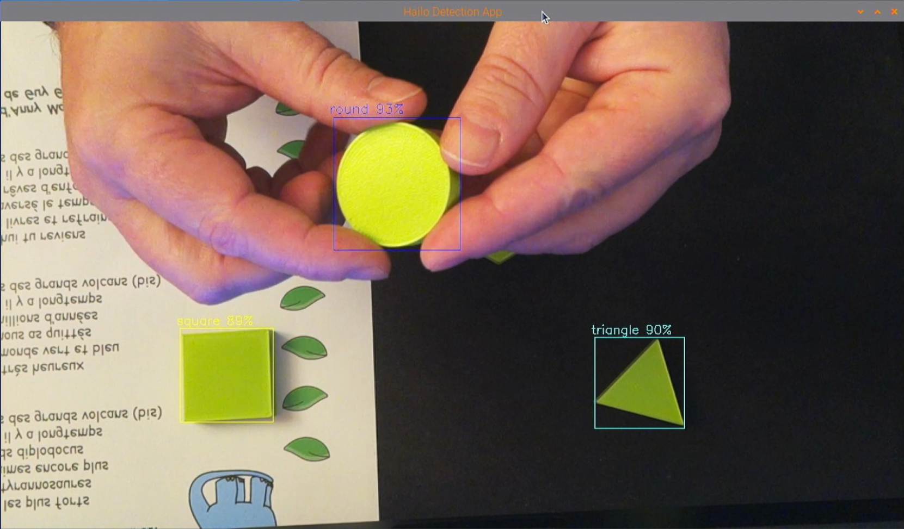

# 3.4 - Déploiement et tests

Dernière étape !!  le test final !! 


## Pré-requis 

Pré-requis pour tester son IA fraîchement compilée :

* Installation et configuration du Raspberry PI5 : Assurez-vous que votre Raspberry PI5 est correctement installé et configuré.
* Installation des exemples proposés par HAILO : Ces exemples permettent de récupérer les dépendances nécessaires ainsi que l'environnement d'exécution.
* Création d'un fichier de configuration JSON : Ce fichier définira les paramètres requis par votre application.
* Utilisation du fichier .hef préalablement copié sur le Raspberry PI pour l'utiliser lors de l'exécution.
---

### Installer et configurer correctement son Raspberry PI5


Documentation officielle :<br>
https://www.raspberrypi.com/documentation/accessories/ai-hat-plus.html<br>
https://www.raspberrypi.com/documentation/computers/ai.html

Un bref résumé ici :<br> 
https://github.com/FredJ21/RPI5_AI_Hailo_tests/blob/main/Doc/2_config_et_tests.md

---

### Installer les exemples proposés par HAILO

```bash
git clone https://github.com/hailo-ai/hailo-rpi5-examples.git
cd hailo-rpi5-examples

./install.sh
```

---

### Le fichier de configuration 

Le fichier de configuration JSON est utilisé pour paramétrer le modèle de détection d'objets.

*3 paramètres :*

* **detection_threshold** : 0.5 → Seulement les objets avec une confiance ≥ 50% seront détectés.
* **max_boxes** : 200 → Limite le nombre d’objets détectés à 200 par image.
* **labels** → Liste des classes d'objets que le modèle peut détecter

Nous devons créer ce fichier :

```bash
vi my_labels.json 

	{
		"detection_threshold": 0.5,
		"max_boxes":200,
		"labels": [
		"unlabeled",
		"hexagon",
		"round",
		"square",
		"triangle"
		]
	}
```
---

## Exécution  

Afin de faciliter l'exécution, j'ai créé un petit script Shell sur mon dépôt GitHub :<br>
https://github.com/FredJ21/RPI5_AI_Hailo_tests

Dans le répertoire ***"Scripts"***


```bash
vi test_my_IA.sh 

	# chemin du projet
	MY_REP=/home/pi/FRED/RPI5_AI_Hailo_tests/Results/20250203_result_from_210125_4_shapes_test_v2

	# nom du fichier de configuration
	MY_LAB=my_labels.json

	# chemin vers le fichier .hef
	MY_HEF=hailo_result_1/yolov8s_with_test_img.hef

	# chargement de l’environnement 
	cd  /home/pi/FRED/hailo-rpi5-examples
	source setup_env.sh

	# lancement de la caméra et de la détection  
	python3 basic_pipelines/detection.py \ 
		--hef-path ${MY_REP}/${MY_HEF} \
		--labels-json ${MY_REP}/${MY_LAB} \
		--input rpi
```

Let's GO !!!

```bash

./test_my_IA.sh 

```


<a href="img/test_1.png"></a>  <a href="img/test_2.png"></a> <a href="img/test_3.png"></a> <a href="img/test_4.png"></a>
<br>

Test final réussi !<br>
La puce HAILO8 exécute le modèle d'IA avec une très bonne précision. La reconnaissance des objets s'effectue en temps réel, démontrant la puissance et l'efficacité du système.<br>
Tous les paramètres et configurations se sont révélés corrects, ce qui confirme la fiabilité de notre pipeline de déploiement et l'optimisation du fichier .hef. C'est une validation concrète de notre travail de compilation et d'intégration sur le Raspberry PI5 !"<br>


<a href="https://youtu.be/b6qGFZ387_Y"></a>
https://youtu.be/b6qGFZ387_Y

---