Après notre petite introduction en partie 1 et la configuration du Raspberry PI en parti 2,<br>
Il est temps de rentrer dans le vif du sujet  !!!<br>

# Partie 3 -"Créer et entraîner son propre IA pour les modules HAILO du Raspberry PI5"

L'objectif est donc de :

* créer une IA de reconnaissance de formes simples
* sur la base de ses propres photos ( ou vidéos )
* et qui puisse exploiter la puissance d'un module IA d'un Raspberry PI5


Nous pouvons distinguer 4 grandes étapes décrites plus bas : 

1. --> la création de son jeu de données, de son dataset
2. --> l’entraînement du modèle IA
3. --> la conversion, ou compilation, du modèle
4. --> le déploiement et les tests    


_Archive du projet :_<br>
où l'on peut retrouver les images et vidéos sources, ainsi que quelques scripts<br>
https://github.com/FredJ21/RPI5_AI_Hailo_tests


---

## 3.1 - Création de son jeu de donnée

Pour la création du Dataset, plusieurs méthodes se présentent à nous : 
 
1. Tout réaliser en local à l'aide d'outils spécifiques et/ou scripts Python 
2. Utiliser une plateforme spécialisée, en ligne, dans le cloud 

J'ai commencé, dans un premier temps, par réaliser mon jeu de donnée en local,<br>
pour ensuite réaliser des versions plus complexes et certainement efficaces sur *Roboflow*,
une plateforme particulière intéressante pour notre besoin.<br>
Je vais donc décrire ces deux approches.


La création du dataset consiste à créer une collection d'images représentatives des objets que l'on souhaite détecter.<br> 
Ces images devront être annotés avec l'emplacement et le nom de l'objet visible.<br>

#### Mais il y a quelques éléments à prendre en considération :

* le format du dataset : YOLOv8

YOLOv8 (You Only Look Once v8) est une version avancée de la célèbre famille de modèles YOLO 
utilisée pour la détection d’objets, la segmentation d’images et la classification. 

YOLOv8 est principalement un modèle d'IA de détection d'objets qui utilise un format spécifique pour les datasets.<br>
Ce modèle d'IA est particulièrement adapté et préconiser pour le module HAILO du Raspberry PI.


#### Autres éléments importants :

- YOLOv8, comme ses prédécesseurs, fonctionne mieux avec des images carrées.
- les images doivent avoir une dimension de 640x640 pixels (par défaut pour YOLOv8) 
   --> Un bon compromis entre précision et performance. 

- l’arborescence des répertoires 
- le format des fichiers d'annotation 
- le nombre de classes
- le nommage des classes ( ex: "carré vert", "rond rouge", triangle "jaune", .... )


Voici un exemple d’organisation du dataset au format YOLOv8 :

```
	Mon_Dataset/
	├── data.yaml
	├── test
	│   ├── images
	│   └── labels
	├── train
	│   ├── images
	│   └── labels
	└── valid
		├── images
		└── labels
```

On y trouve : 

- le fichier *"data.yaml"* qui contient la liste des sous répertoires, le nombre et le nom des classes
- 3 répertoires : *"train", "valid", "test"*
- contenant chacun 2 sous répertoires : *"images" et "labels"* 

Le fichier label, au format texte (.txt) est donc stocké dans un répertoire différent de l'image correspondante,<br>
mais le lien entre ces deux fichiers est fait par leur nom ( mon_image_12345.jpg --> mon_image_12345.txt )

Enfin, les données doivent être répartis selon un certain ratio : 

* 70 % pour le trainning --> rep *"train"*
* 15 % pour la validation --> rep *"valid"*
* 15 % pour les tests --> rep *"test"*

Nous pourrions également envisager un répartition de 70/20/10 , ou 75/15/10 .... à tester ...

---

## 3.1.1 Création du Dataset en local 

J'ai réalisé de nombreux tests de création de dataset, avec 12 objets différents (12 classes),
différents fonds, plusieurs type d'éclairage ...  mais ça commençait à se compliquer un peu ... 
surtout quand le résultat attendu n'était pas vraiment au rendez vous .... 

J'ai donc réduit la voilure avec Dataset est composé de 2 classes  :  "carré vert"  & "carré rouge"<br>


Les fichiers sources, de mon derniers tests, son disponibles dans mon repo GitHub :
https://github.com/FredJ21/RPI5_AI_Hailo_tests


```bash
git clone https://github.com/FredJ21/RPI5_AI_Hailo_tests
cd RPI5_AI_Hailo_tests

ls -al Dataset/Fred_Dataset/images_HD_2

```

----

#### Les photos :

J'ai donc fait plein de photos de mes pièces en vaillant, bien évidement, à réaliser autant de photos pour chacune d'entre elle : 

- 75 photos pour le trainning  dans le répertoire *"train"* (*)
- 15 photos pour la validation dans le répertoire *"valid"* (*)
- 15 photos pour les tests dans le répertoire *"test"* (*)

**( pour chaque classe d'objet !!! )*

Pour réaliser ces photos, c'est très simple !  il suffit d'utiliser la camera du Raspberry PI ! <br>
Avec la commande suivante : 

```bash
rpicam-jpeg  --camera ${CAMERA} --output ${FILE} --timeout ${TIMEOUT} --autofocus-mode manual --lens-position 0.0
```
Cela produit une image haute définition de 4608x2592 pixels et d'environ 3,3 Mo.

<a href="photos/1734219226.jpg"></a>
<a href="photos/1734220832.jpg"></a>
<a href="photos/1734220572.jpg"></a>
<a href="photos/1734219623.jpg"></a>

Le script **"prendre_une_photo.sh"** ( dans le répertoire [GIT]Scripts/bin ) permet d'automatiser la séance !<br>
en prenant une photo toutes les 2 secondes et en répartissant les clichés des les répertoires : train, valid, et test.<br>
Le nom des fichiers correspond à un horodatage de type timestamp. 

```bash
ls -al Dataset/Fred_Dataset/images_HD_2/test/*jpg

-rw-r--r-- 1 pi pi 2994083 15 déc.  00:47 Dataset/Fred_Dataset/images_HD_2/test/1734220016.jpg
-rw-r--r-- 1 pi pi 3009538 15 déc.  00:47 Dataset/Fred_Dataset/images_HD_2/test/1734220032.jpg
-rw-r--r-- 1 pi pi 3367522 15 déc.  00:47 Dataset/Fred_Dataset/images_HD_2/test/1734220038.jpg
-rw-r--r-- 1 pi pi 3281630 15 déc.  00:47 Dataset/Fred_Dataset/images_HD_2/test/1734220046.jpg
-rw-r--r-- 1 pi pi 3273484 15 déc.  00:47 Dataset/Fred_Dataset/images_HD_2/test/1734220051.jpg
../..
```

----

#### Les labels :

Il est temps maintenant d'annoter les images.<br>

Cette opération d'étiquetage consiste à dessiner un cadre de délimitation autour des objets présents sur les photos, tout en précisant sa classe ( "carré vert" ou "carré rouge" ) ?<br>

Cette opération nécessite une certaine précision et un peu de patience !!!<br>
Le cadres doit être serré mais pas trop proche.<br>
Il ne doit pas y avoir de sur ajustement dans le cas ou plusieurs objets sont présents sur la même photo.<br>
*( mais par soucis de simplification, mes images ne comportent q'un seul objet )*

Dans mon cas, j'ai choisi de réaliser des photos distinctes par type d'objet. J'ai donc qu'un seul objet par photo. 

Je souhaitais également réaliser cette opération complètement en local, sur mon Raspberry PI5, à l'aide d'un utilitaire très léger.<br>
J'ai utilisé **"YOLO-Label"** que l'on peut trouver ici : https://github.com/developer0hye/Yolo_Label

"YOLO-Label" est également disponible dans une version pré-compilé pour le Raspberry PI 64bits (version Debian/PiOS 12 bookworm) sur mon GIT :  

```bash
cd RPI5_AI_Hailo_tests//Scripts/bin/Yolo_Label/
chmod +x YoloLabel
./YoloLabel
```


*(animation d'exemple du site officiel)*


L'utilisation est très simple et doit être réalisé sur l'ensemble des photos de DataSet.<br>
- on sélectionne le répertoire de travail qui contient les images
- on sélectionne la liste des classes ( *labels_list.txt* )
- on choisi une classe 
- on dessine en carré pour délimiter notre pièce 
- next ... 

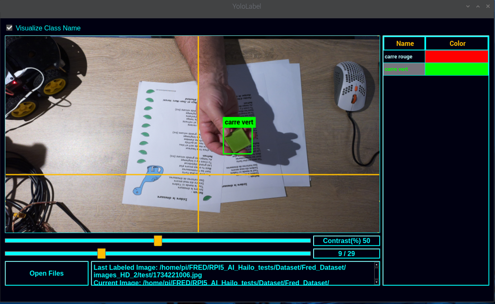</a>
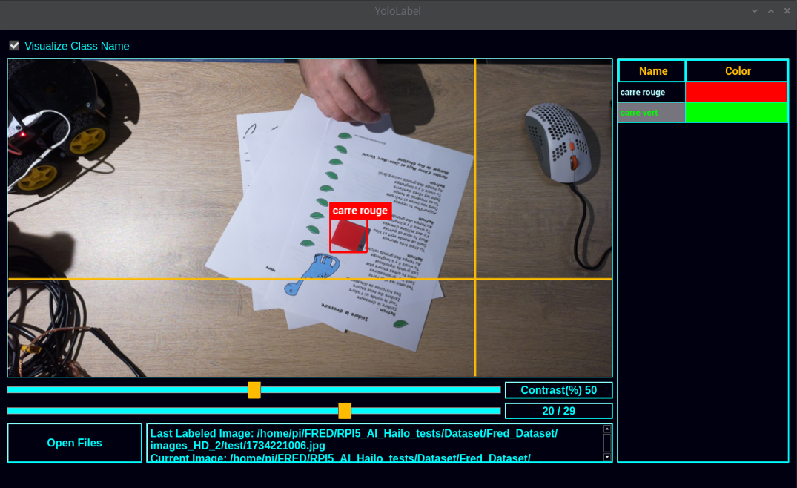</a>

Tous les fichiers jpeg sont maintenant accompagnés par un fichier text du même nom mais avec l’extension .txt .   

	1734219226.jpg	-->  1734219226.txt
	1734220832.jpg  -->  1734220832.txt
	1734220572.jpg  -->  1734220572.txt
	1734219623.jpg  -->  1734219623.txt

Ces fichiers contiennent 5 valeurs numérique :

```bash
$ cat train/1734219226.txt 

1 0.637242 0.526384 0.053579 0.094291
```

* l'index de la classe d'objet (0->carré route, 1->carré vert) et les 
* la position en X du centre de l’objet
* la position en Y du centre de l’objet
* la largeur de l’objet 
* la hauteur de l’objet

Les coordonnées sont normalisées de 0 à 1

----

####  Augmentation du nombre d'image

Nous avons donc, pour l'ensemble de nos objets : 
- 150 photos d'entraînement, 
- 30 photos de validation, 
- 30 photos de test,
- les photos sont au format .jpg et d'une dimension de 4608x2592 pixels,
- chaque photo est accompagné de son fichier label au format .txt


Il maintenant nécessaire de redimensionner les photos au format 640x640 pixels (pour YOLOv8),<br>
de plus, il est intéressant d'**augmenter artificiellement** le nombre de photos !!<br>
En effet l'entraînement de l'IA sur un plus grand nombre de photos permettra d'obtenir de meilleurs résultats 


Plusieurs solutions permettent d'augmenter le nombre de photos : 

* **recadrer** l'image par rapport à l'objet en positionnant l'objet plus ou mois sur la droite ou plus ou mois sur la gauche <br>
--> cette opération permet de passer d'un format de 4608x2592 pixels  à un format carré de 640x640 pixels
* réaliser une ou plusieurs **rotation** d'image
* ajouter artificiellement du **bruit** ( des points blancs ou noirs )
* réaliser plusieurs **itérations** par image source


J'ai développé un script Python pour réaliser cela  :

```bash 
cd RPI5_AI_Hailo_tests/Scripts/

python3 -m venv --system-site-packages venv
source venv/bin/activate
pip install -r requirements.txt

cd bin

cat dataset_HD_to_640x640.conf

	{
		"REP_IN"  : "../../Dataset/Fred_Dataset/images_HD_2",
		"REP_OUT" : "/home/pi/My_Dataset/",
		"IMG_FILE_EXT"   : ".jpg",
		"LABEL_FILE_EXT" : ".txt",
		"Nb_Iteration_par_image" : 15,
		"Add_Noise" : 1,
		"Retournement" : 3
	}
```

Le fichier de configuration défini les répertoires source et destination, le nombre de bruit, le nombre de retournent d'image<br>
Le script se chargera également de recalculer la nouvelle position, en x et y, de l'objet et ses dimensions afin de produire un nouveau fichier label.<br>    
Le répertoire cible (REP_OUT) n'est pas obligé d'exister, le script se chargera de créer toute l’arborescence de répertoires.

*GO !!!* 


```bash 

python dataset_HD_to_640x640.py

```

Puisque nous avons réalisé 15 itérations, pour lesquels nous avons une version avec et sans bruit, et 3 retournents en plus de la position de départ    

- 150 * 15 * 2 * 4 --> 18000 photos le répertoire *"train"* 
- 30 * 15 * 2 * 4 --> 3600 photos dans le répertoire *"valid"* 
- 30 * 15 * 2 * 4 --> 3600 photos dans le répertoire *"test"*

cd qui donne un total de 25200 photos accompagnées de leurs annotations !<br>
en effet : 

```bash
find /home/pi/My_Dataset -name *jpg | wc -l

	25200
```
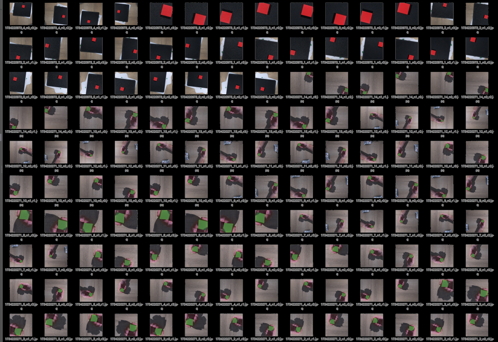</a>

Notre Dataset en prêt à être utilisé pour l'aprentissage  !!! 

---


## 3.1.2 Création du Dataset sur Roboflow

Une autre solution pour réaliser son dataset et l'annotation de ses images, est d'utiliser un outil en ligne.<br>

**Roboflow** ( https://roboflow.com/ ) est une plateforme tout-en-un qui facilite la gestion, l'annotation, l'augmentation et l'exportation de datasets pour l'entraînement de modèles de vision par ordinateur. Elle est particulièrement utile pour des modèles comme YOLOv8, Faster R-CNN, SSD, et d'autres.

On peut identifier plusieurs fonctionnalités très intéressantes :  

* Annotation d’images : Interface web collaborative pour annoter rapidement les objets.
* Augmentation des données : Ajout automatique de variations (rotation, flou, contraste, etc.) pour améliorer la robustesse du modèle.
* Conversion de formats : Compatible avec YOLO, COCO, Pascal VOC, et d'autres standards.
* Hébergement & API : Stocke et gère les datasets, avec accès via API pour automatiser les workflows.
* Entraînement et déploiement : Intégration avec des frameworks d'IA (PyTorch, TensorFlow) et déploiement dans le cloud ou en edge computing.


Une dès première fonctionnalité très intéressante :  

* **Roboflow permet d'extraire une série de photos depuis une vidéo !!!**

### Nouveau Dataset :

Cette fois ci, pour ce nouveau Dataset, j'ai choisi un nouvel énoncé de départ :

* un Dataset avec 4 classes : round, square, triangle, hexagon
* les 4 objets sont de couleur identique ( vert )
* les images sont extraites de 4 vidéos distinctes
* chaque vidéo dure exactement de 20 secondes 


Pour réaliser les vidés, c'est très simple !  il suffit d'utiliser la camera du Raspberry PI ! <br>
Avec la commande suivante : 

```bash
	rpicam-vid --camera 0 -t20000 --autofocus-range normal --autofocus-speed fast -o square.mp4
```

Nous pouvons bien évidement ajuster les parametres d'autofocus et autres ... 

Ces vidéos de départ sont dans le répertoire :  *Dataset/210125_4_shapes_TEST.sources* du dépo Git :

```bash
ls -al Dataset/210125_4_shapes_TEST.sources/

	-rw-rw-r-- 1 fredj21 fredj21 4881188 janv. 29 13:37 hexagon.mp4
	-rw-rw-r-- 1 fredj21 fredj21 4985373 janv. 29 13:37 round.mp4
	-rw-rw-r-- 1 fredj21 fredj21 4848499 janv. 29 13:37 square.mp4
	-rw-rw-r-- 1 fredj21 fredj21 5261945 janv. 29 13:37 triange.mp4
```

---

Direction donc  --> http://www.roboflow.com/  

Après s'être identifié,<br>
on crée un nouveau projet **public** de type "Object Detection" avec le mon des déférentes classes

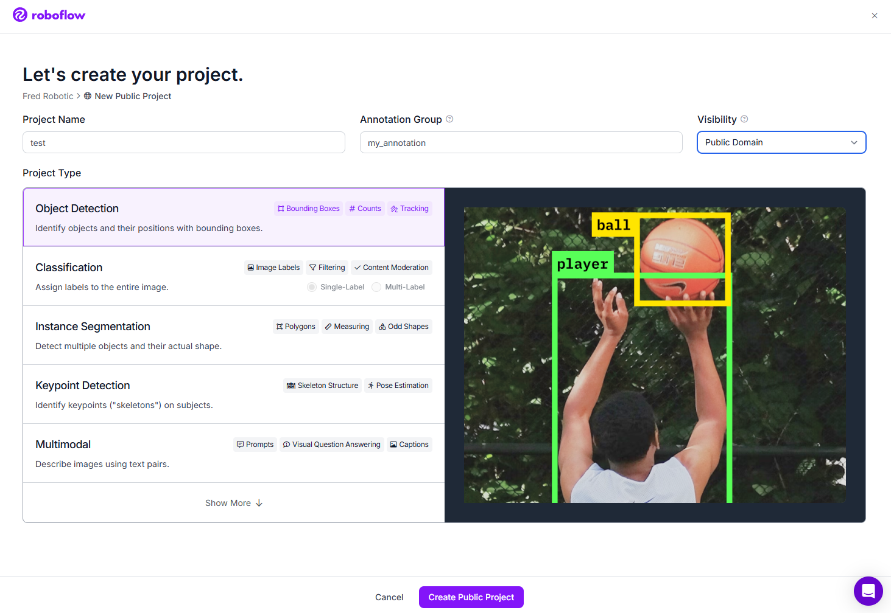</a>

Ensuite, nous ajoutons les classes à notre projet 

* round, 
* square, 
* triangle, 
* hexagon

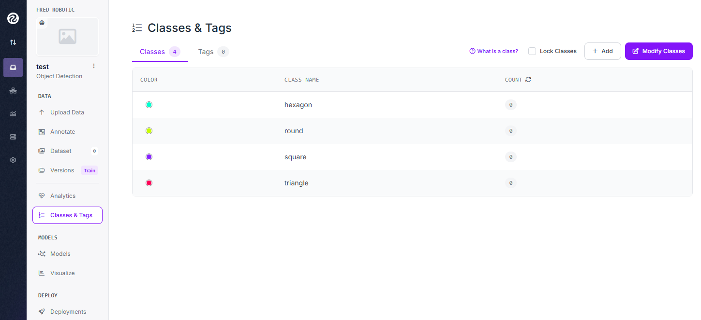</a>


Maintenant, dans la section "Upload Data", nous importons chaque vidéo, l'une après l'autre<br>
avec une fréquence d’échantillonnage de **5 images par seconde** (choix arbitraire à adapter à ses besoins) <br> 

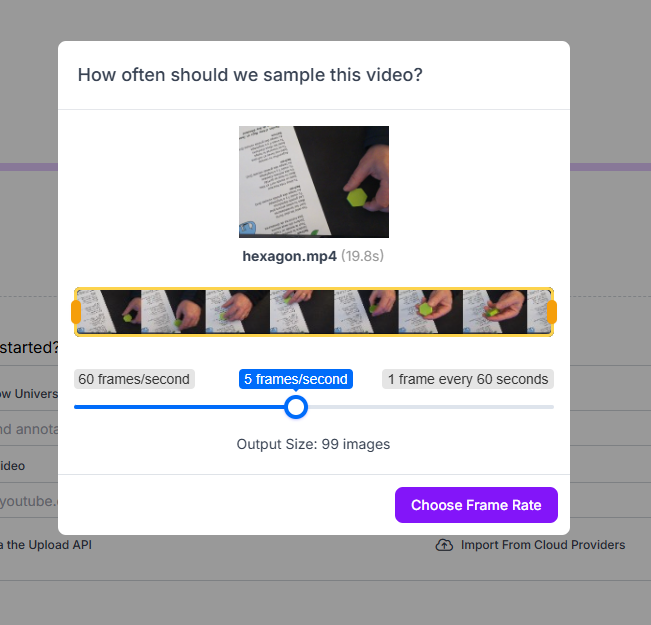  

On crée des tache de type  **"Manual Labeling"**,  que l'on assigne à soi même.<br>

En effet, la plateforme est collaborative, et permet d'assigner des taches à différentes personnes<br>
Dans la section "Annotate", nous pouvons visualiser les différentes taches restants, la personne en charge de cette tache, le taux de réalisation    

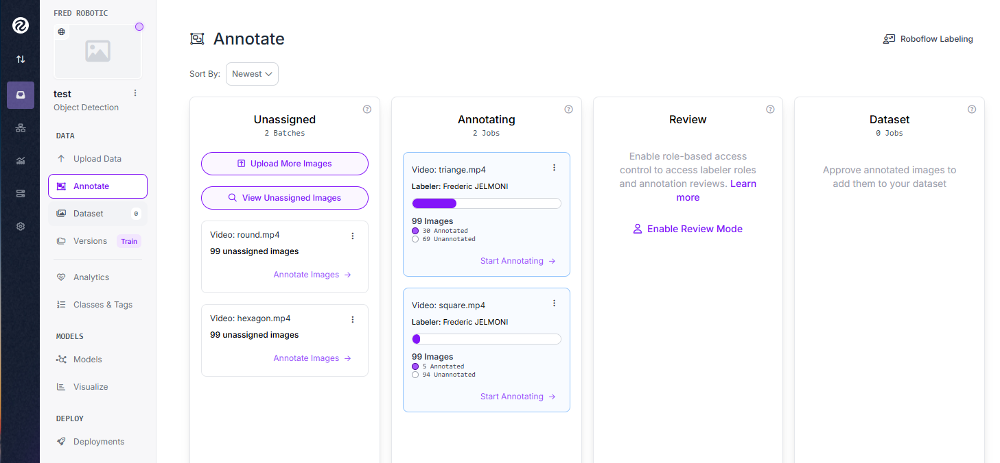<br>


Pas de difficulté lors du labeling, il faut juste veiller à sélectionner la bonne classe ....  et avoir un peu de patience !!! <br>

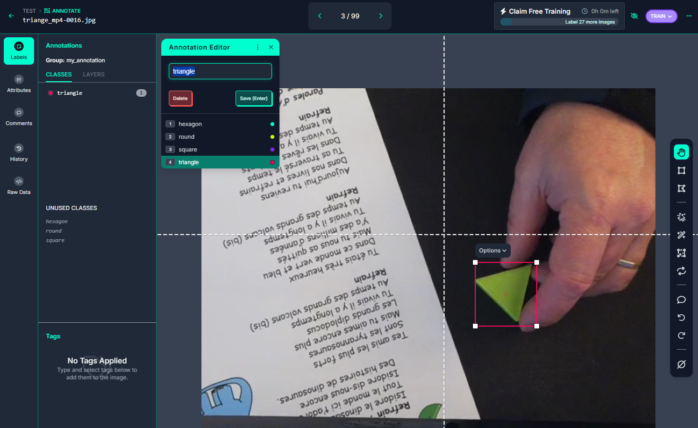 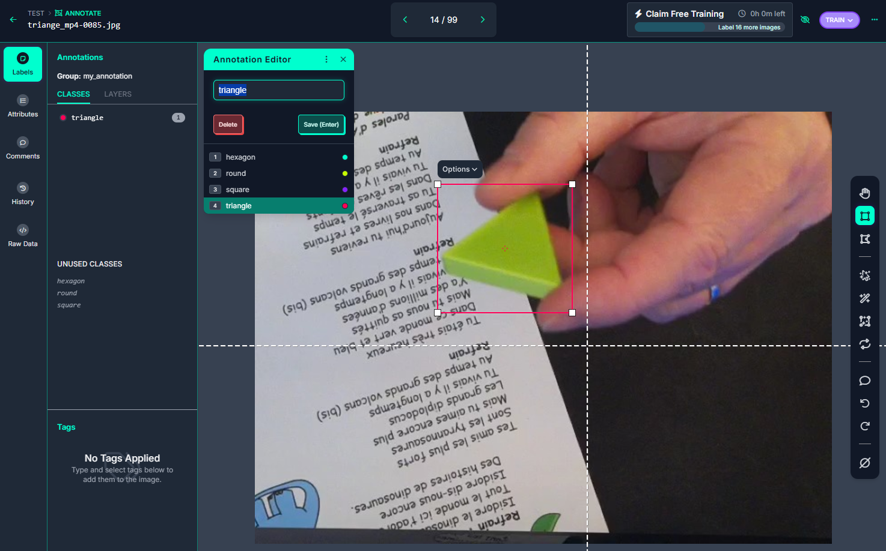
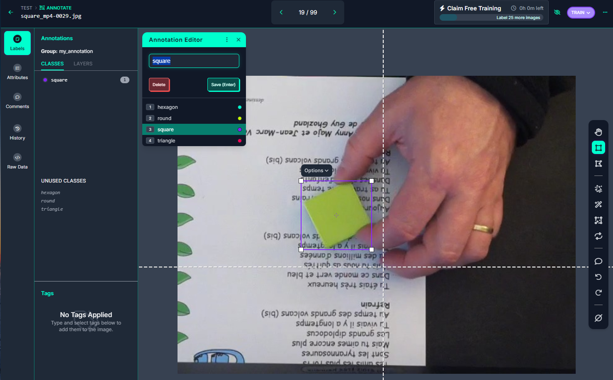 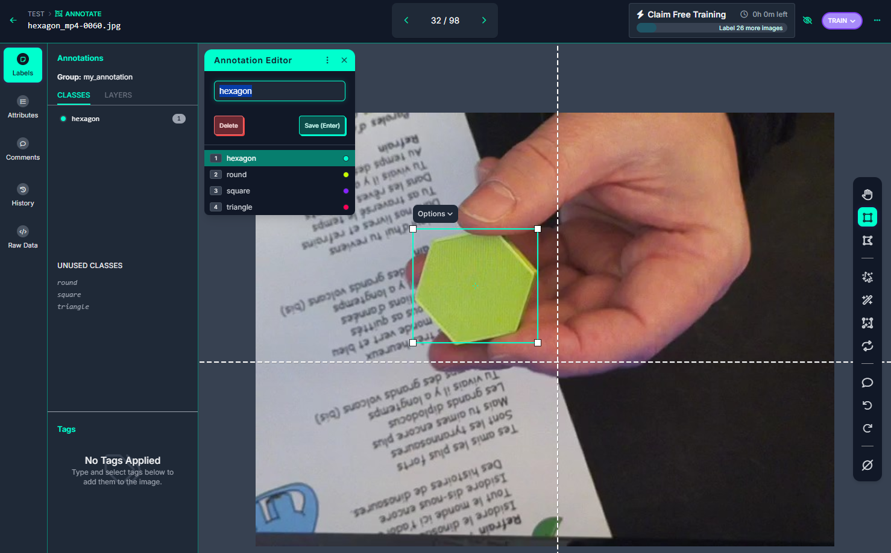


Après avoir annoter l'ensemble des images, nous allons ajouter ces images à notre Dataset en utilisant la méthode *"Split Images Between Train/Valid/Test"* qui permettra de répartir aléatoirement nos photos pour les besoins de trainning, validation et test.

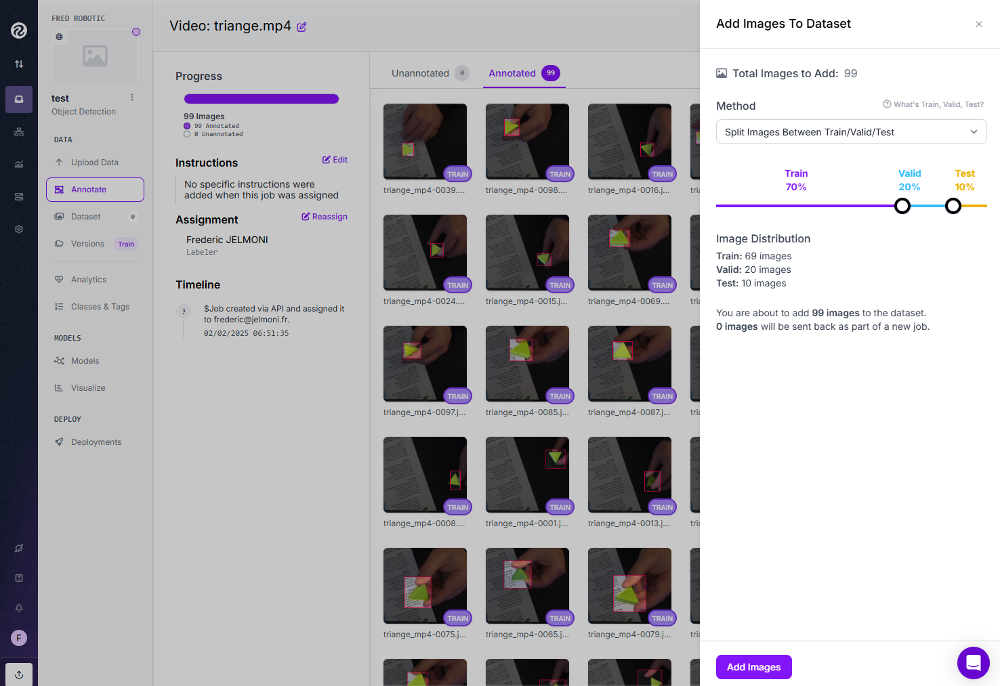<br>


Enfin, il nous reste à générer une nouvelle version de notre Dataset en appliquant des opérations de **rotation**, ajout de **bruit**, passage de certaines photos en **niveau de gris**, .... <br>

Dans la section "Dataset" --> "Generate Version"

Le but étant, ici, d'augmenter artificiellement le nombre de photos de notre Dataset<br>

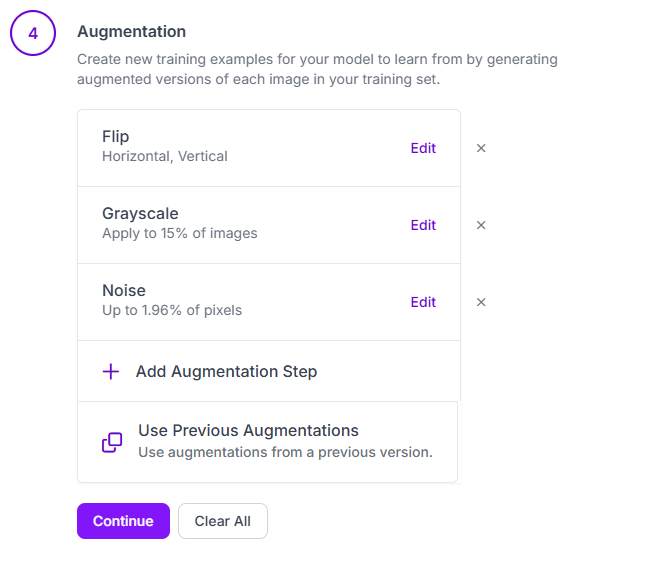<br>


### Pour résumer cette création de son jeu de données sur Roboflow:

Nous sommes parti sur la base de :
* 4 vidéos de 20 secondes 
* un échantillonnage de 5 images par seconde
* ce qui donne : **99 images par classe** 

Après l"opération de "split", nous obtenons :

* 70 %  Train			--> 69 images
* 20 %  Validation		--> 20 images	
* 10 %  Test			--> 10 images

Un total donc, pour l'ensemble des classes de  :

* 276 image de trainning
* 80 images de Validation
* 40 image de Test
   
Ensuite, la création d'une version du Dataset ( augmentation du nombre d'image)

* rotation horizontal et vertical
* gris 	15% des images
* bruit 1.96%

Lors de cet augmentation, nous sommes limité, dans la version gratuite de Roboflow, à 1500 images !<br>
Nous avons donc maintenant : 	

* 1380 image de trainning
* 80 images de Validation
* 40 image de Test

### Téléchargement du jeu de données

Nous pouvons maintenant télécharger notre Dataset dans de nombreux formats<br>
--> particulièrement au format **YOLOv8** pour la suite de notre projet ! <br>


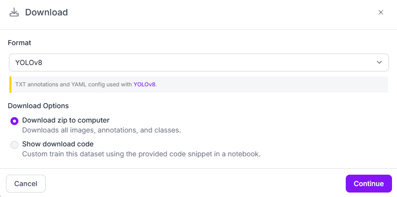<br>


l'ensemble des fichiers se trouve dans le répertoire :  *Dataset/210125_4_shapes_TEST.v2i.yolov8/* du dépo Git :

```bash
ls -l Dataset/210125_4_shapes_TEST.v2i.yolov8

	-rw-rw-r-- 1 fredj21 fredj21  299 févr.  2 08:08 data.yaml
	-rw-rw-r-- 1 fredj21 fredj21  150 févr.  2 08:08 README.dataset.txt
	-rw-rw-r-- 1 fredj21 fredj21 1190 févr.  2 08:08 README.roboflow.txt
	drwxrwxr-x 4 fredj21 fredj21 4096 févr.  2 08:08 test
	drwxrwxr-x 4 fredj21 fredj21 4096 févr.  2 08:08 train
	drwxrwxr-x 4 fredj21 fredj21 4096 févr.  2 08:08 valid


tree Dataset/210125_4_shapes_TEST.v2i.yolov8 -d

	Dataset/210125_4_shapes_TEST.v2i.yolov8
	├── test
	│   ├── images
	│   └── labels
	├── train
	│   ├── images
	│   └── labels
	└── valid
		├── images
		└── labels
```

### Prêt à coder !!! 

Robotflow propose également, dans la section "Download", plusieurs méthodes d'accès au Dataset.<br>
et plus particulièrement une librairie Python pour automatiser le téléchargement de son Dataset<br>

```bash
pip install roboflow

python

	from roboflow import Roboflow
	rf = Roboflow(api_key="xxxxxxxxxxxxxxxxxxx")
	project = rf.workspace("fred-robotic").project("210125_4_shapes_test")
	version = project.version(2)
	dataset = version.download("yolov8")
```

# 3.2 - Entraînement du modèle IA

2 solutions :  

* entraîner le modèle en local, sous linux
* ou sur Google Colab

###  Entrainement du modèle sous linux

il ne sera pas possible de réaliser cette étape directement sur un Rasperry PI 

En effet, l'entrainement de l'IA necessite beaucoup de calculs et donc de ressources (memoire/cpu/gpu),<br>
il est fortement recommendé d'utiliser un PC puissant équipé d'une bonne grosse carte GPU 


Cette solution est techniquement très interressante et surtout très chronophage car elle nécessite pas mal de configuration sous linux pour installer l'ensemble des outils et leurs dépendances !<br>

MAIS, fort heureusement **HAILO propose des environnements pré-configurés sous forme de conteneur Docker**<br>
L'environnement Docker s'installe et s'utilise en quelques lignes :


```bash 
git clone https://github.com/hailo-ai/hailo_model_zoo.git
cd hailo_model_zoo/training/yolov8

docker build --build-arg timezone=`cat /etc/timezone` -t yolov8:v0 .

docker run --name "yolov8" -it --gpus all --ipc=host -v  /data_1:/data  yolov8:v0
```

## Dans le DOCKER YOLOv8

Nous voila dans le conteneur Docker Yolo8 !!!<br>
A noter que le repertoire ***/data*** du conteneur **est mappé** avec le répertoire ***/data_1*** de la machine linux hote<br>
--> cela permetra d'extraire les résultas des traitements 


Nous pouvons dans, un premier temps, vérifier détection correcte de la carte vidéo et des drivers CUDA

```bash 
$ nvidia-smi 

Sun Feb  2 15:08:44 2025       
+-----------------------------------------------------------------------------------------+
| NVIDIA-SMI 550.120                Driver Version: 550.120        CUDA Version: 12.4     |
|-----------------------------------------+------------------------+----------------------+
| GPU  Name                 Persistence-M | Bus-Id          Disp.A | Volatile Uncorr. ECC |
| Fan  Temp   Perf          Pwr:Usage/Cap |           Memory-Usage | GPU-Util  Compute M. |
|                                         |                        |               MIG M. |
|=========================================+========================+======================|
|   0  NVIDIA GeForce RTX 4070 ...    Off |   00000000:01:00.0  On |                  N/A |
|  0%   42C    P2             41W /  285W |     418MiB /  16376MiB |      0%      Default |
|                                         |                        |                  N/A |
+-----------------------------------------+------------------------+----------------------+
                                                                                         
+-----------------------------------------------------------------------------------------+
| Processes:                                                                              |
|  GPU   GI   CI        PID   Type   Process name                              GPU Memory |
|        ID   ID                                                               Usage      |
|=========================================================================================|
+-----------------------------------------------------------------------------------------+
```

Ensuite , nous allons créer 2 répertoires 
* l'un pour le Dataset
* l'autre pour le résultat des trailements Yolo

```bash
mkdir /data/my_dataset
mkdir /data/my_yolo8s
```

### Récupération (téléchargement) de notre Dataset

Comme nous l'avons vu plus haut, il existe plusieurs méthodes pour retrouver son Dataset précédement créé sur Robotflow<br>
Une des plus simple est la commande "curl"  :

```bash
apt install curl unzip

cd /data/my_dataset
curl -L "https://app.roboflow.com/ds/MtF5ewIPDd?key=DtuQjJYrBl" > roboflow.zip; unzip roboflow.zip; rm roboflow.zip


root@50b81f5f3e9f:/data/my_dataset# ls -l 

	-rw-r--r-- 1 root root  150 Jan 24 13:16 README.dataset.txt
	-rw-r--r-- 1 root root 1190 Jan 24 13:16 README.roboflow.txt
	-rw-r--r-- 1 root root  299 Jan 24 13:16 data.yaml
	drwxr-xr-x 4 root root 4096 Jan 24 13:16 test
	drwxr-xr-x 4 root root 4096 Jan 24 13:16 train
	drwxr-xr-x 4 root root 4096 Jan 24 13:16 valid

```

### YOLO - Entrainement 

**VOILA !!! Nous y sommes !!!**   ... nous allons maintenant lancer le traintement d'aprenntissage de notre IA 

```bash
cd /data/my_yolo8s

yolo task=detect mode=train model=yolov8s.pt data=/data/my_dataset/data.yaml  epochs=100 batch=8 
```

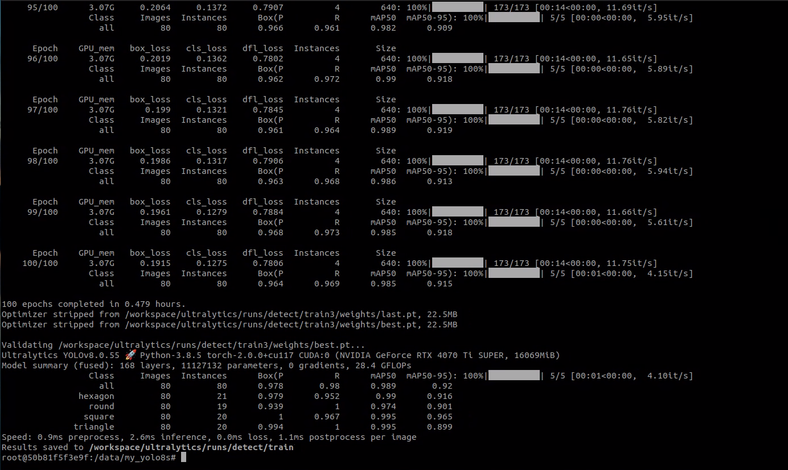

... et après un certain temps, parfois plusieurs heures .....  ( ici, un peu mois d'une heure)<br>
Notre IA est là, le réseau de neurones que nous allons exploiter est dans fichier **best.pt**  


```bash
root@50b81f5f3e9f:/data/my_yolo8s# ls -l /workspace/ultralytics/runs/detect/train/weights/
total 43968
-rw-r--r-- 1 root root 22510584 Feb  2 15:52 best.pt
-rw-r--r-- 1 root root 22510584 Feb  2 15:52 last.pt
```

### YOLO - Validation  

```bash 
	yolo task=detect mode=val model=/workspace/ultralytics/runs/detect/train/weights/best.pt data=/data/my_dataset/data.yaml
```
*résultat :*
```bash
	Ultralytics YOLOv8.0.55 🚀 Python-3.8.5 torch-2.0.0+cu117 CUDA:0 (NVIDIA GeForce RTX 4070 Ti SUPER, 16069MiB)
	Model summary (fused): 168 layers, 11127132 parameters, 0 gradients, 28.4 GFLOPs
	val: Scanning /data/my_dataset/valid/labels.cache... 80 images, 0 backgrounds, 0 corrupt: 100%|██████████| 80/80 [00:00<?, ?it/s]
					Class     Images  Instances      Box(P          R      mAP50  mAP50-95): 100%|██████████| 5/5 [00:01<00:00,  3.80it/s]
					all         80         80      0.978       0.98      0.989      0.921
				hexagon         80         21      0.979      0.952       0.99      0.916
					round         80         19      0.939          1      0.974      0.901
					square         80         20          1      0.967      0.995      0.965
				triangle         80         20      0.994          1      0.995      0.899
	Speed: 1.8ms preprocess, 2.8ms inference, 0.0ms loss, 0.9ms postprocess per image
	Results saved to /workspace/ultralytics/runs/detect/val
```

### YOLO - Test d'Inference

```bash 
yolo task=detect mode=predict model=/workspace/ultralytics/runs/detect/train/weights/best.pt conf=0.25 source=/data/my_dataset/test/images save=True
```

*résultat :*

```bash 
Ultralytics YOLOv8.0.55 🚀 Python-3.8.5 torch-2.0.0+cu117 CUDA:0 (NVIDIA GeForce RTX 4070 Ti SUPER, 16069MiB)
Model summary (fused): 168 layers, 11127132 parameters, 0 gradients, 28.4 GFLOPs

image 1/40 /data/my_dataset/test/images/hexagon_mp4-0003_jpg.rf.c293d0bda8579255c22e0bb3adec7517.jpg: 640x640 1 hexagon, 6.0ms
image 2/40 /data/my_dataset/test/images/hexagon_mp4-0004_jpg.rf.cc7bd017125af4dbd404019b3770f394.jpg: 640x640 1 hexagon, 4.6ms
image 3/40 /data/my_dataset/test/images/hexagon_mp4-0008_jpg.rf.4fd6e77433c04562e72f935866ce0f6f.jpg: 640x640 1 hexagon, 4.5ms
image 4/40 /data/my_dataset/test/images/hexagon_mp4-0019_jpg.rf.7d1cf963c7a1ec1475e9835eb22823fe.jpg: 640x640 1 hexagon, 4.4ms
../..
image 18/40 /data/my_dataset/test/images/round_mp4-0072_jpg.rf.a7b124ffd4ac510cb800640b2662692c.jpg: 640x640 1 round, 5.2ms
image 19/40 /data/my_dataset/test/images/round_mp4-0073_jpg.rf.17cc51715ce2f318fbe54c4cf027eb25.jpg: 640x640 1 round, 4.4ms
image 20/40 /data/my_dataset/test/images/round_mp4-0079_jpg.rf.726d39195525a9379b7a0d027cc95fa2.jpg: 640x640 1 round, 5.3ms
image 21/40 /data/my_dataset/test/images/square_mp4-0008_jpg.rf.2de6b97777c35ad77243686b52db8fdd.jpg: 640x640 1 square, 4.3ms
image 22/40 /data/my_dataset/test/images/square_mp4-0031_jpg.rf.51e2987542775d7b404283d2555c1e89.jpg: 640x640 1 square, 4.4ms
../..
image 38/40 /data/my_dataset/test/images/triange_mp4-0093_jpg.rf.a5e21f5433c42886dfa68207bf33bcf4.jpg: 640x640 1 triangle, 4.3ms
image 39/40 /data/my_dataset/test/images/triange_mp4-0094_jpg.rf.ca41d949218064b2667407a288294d54.jpg: 640x640 1 triangle, 4.5ms
image 40/40 /data/my_dataset/test/images/triange_mp4-0097_jpg.rf.42740df0f5c5443d917efcfb888b12b6.jpg: 640x640 1 triangle, 4.4ms
Speed: 0.4ms preprocess, 4.9ms inference, 1.3ms postprocess per image at shape (1, 3, 640, 640)
Results saved to /workspace/ultralytics/runs/detect/predict

```

### YOLO - Export du modèle au formant ONNX

```bash 
yolo export model=/workspace/ultralytics/runs/detect/train/weights/best.pt imgsz=640 format=onnx opset=11
```

*résultat :*

```bash 
	ONNX: export success ✅ 0.7s, saved as /workspace/ultralytics/runs/detect/train/weights/best.onnx (42.7 MB)
```


### YOLO - Sauvegarde 

Il est temps maintenant, de copier tous ces résultats en dehors du conteneur Docker dans lequel nous sommes :

```bash
cp -rv /workspace/ultralytics/runs/detect/* /data/my_yolo8s 

ls -l /data/my_yolo8s 

	drwxr-xr-x 2 root root     4096 Feb  2 16:26 predict
	drwxr-xr-x 3 root root     4096 Feb  2 16:26 train
	drwxr-xr-x 2 root root     4096 Feb  2 16:26 val
	-rw------- 1 root root  6534387 Feb  2 15:23 yolov8n.pt
	-rw------- 1 root root 22573363 Feb  2 15:23 yolov8s.pt
```

Nous pouvons mantenant sortir de notre conteneur Docker 

```bash
exit
```


# 3.3 - Conversion du modèle


TODO


# 3.4 - Déploiement et tests


TODO