# Créer et entrainer son propre IA pour les modules HAILO du Raspberry PI5


Je vous propose mon retour d’expérience sur la mise en œuvre d'une intelligence artificiel, sur une carte Raspberry PI5, capable de reconnaître et différentier un ensemble d'objets personnels.

Le principe est d’entraîner un réseau de neurones, de façon automatique, à l'aide d'un ensemble de données composés d'un certain nombre d'images : le "DataSet".

Ce réseau de neurones, ou "IA", sera ensuite capable de reconnaître les objets pour lequel nous l'avons entraîné.<br>
Ou plus exactement, l'IA sera capable d'effectuer une prédiction de reconnaissance avec un certain taux de certitude.
         
---

## Au sommaire :

    1 - Introduction
    2 - Tests rapide du module AI
      2.1 - le module AI-Kit
      2.2 - la carte AI
	  2.3 - les cameras RPI

	3 - Création de son propre réseau de neurones 
      3.1 - Création de son jeu de donnée
		3.1.1 - Création du Dataset en local 
		3.1.2 - Création du Dataset sur le cloud
      3.2 - Entraînement du modèle IA
      3.3 - Conversion du modèle
      3.4 - Déploiement et tests

    7 - Conclusion

---


# Partie 1 - Introduction

L'année 2024 fut marquée, particulièrement pour nos chères cartes Raspberry PI, par l'arrivé de multiples modules AI officiels.

Ces modules, proposés par la fondation Raspberry, sont capables de réaliser les traitements requis par l’utilisation de réseaux de neurones de l'IA que l'on souhaite mettre en œuvre;
comme le ferait un GPU  (Graphics Processing Unit) dans une grosse machine ... 
et ainsi, réduire considérablement les sollicitations du microprocesseur principal (CPU) .   

En pratique, les modules accélérateur d'IA permettent de créer des applications complexes de traitement vidéo en temps réel, 
ou de "vision intelligente par ordinateur", avec une très faible latence, même sur des ordinateurs de taille modeste !
les domaines d'application sont très nombreux ! on peut citer par exemple : la détection d'objets, la détection de personne, de visage, 
la segmentation d'image, la classification, la détection de pose, le suivi (ou tracking).

---
  
### En juin 2024 - le "kit AI" 

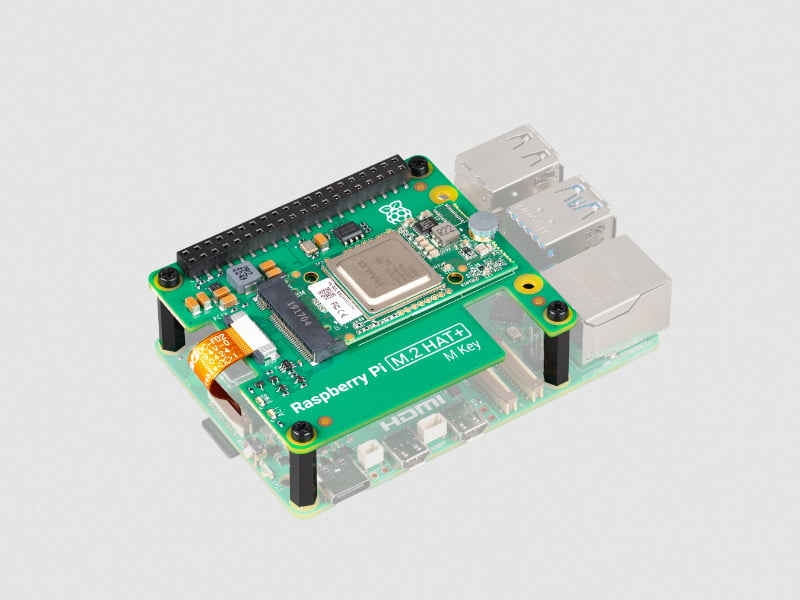

Ce kit est composé d'une carte d’extension au format Raspberry disposant d'un connecteur M2 , la carte **M2 HAT.+**<br>
Le connecteur M2 utilise le bus PCIe 3.0 à une vitesse de 8Gbit/s et peut éventuellement accueillir un disque SSD,<br>
mais dans le cadre de notre Kit, le connecteur accueille un module accélérateur d'IA **Hailo-8L**.<br>
Le puce accélératrice  Hailo-8L est capable de réaliser 13 Téra-opérations par seconde (13 TOPS) et est évidement compatible avec les module caméra du RPI. <br>
Le kit est accompagné d'une suite logiciel permettant de faire ses premiers pas autour des libs rpicam-apps ( on en parle plus bas )

---

### En juillet 2024 - le compilateur Hailo DFC

Très rapidement, le mois suivant, Hailo annonce la sorti de son compilateur Dataflow (DFC) qui permet de personnaliser le réseau de neurone selon ses besoins.<br> 
Un conteneur Docker est proposé pour faciliter l'installation.

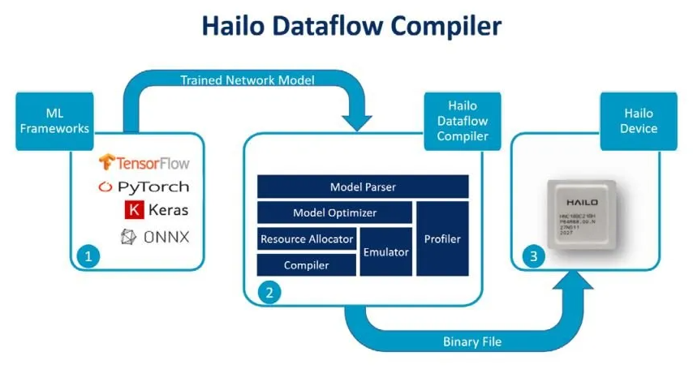

_2 méthodes sont proposées :_

* **Bring Your Own Data (BYOD)** - Apportez vos propres données<br>
   qui consiste à "recycler" un modèle déjà entraîné, mais cette fois ci avec son propre jeu de données.<br>
	https://github.com/hailo-ai/hailo-rpi5-examples/blob/main/doc/retraining-example.md<br>
* **Bring Your Own Model (BYOM)** - "Apportez votre propre modèle"<br>
	qui nécessite une compréhension plus approfondie du modèle de données et du flux de conversion (le "workflow") vers le format HEF des modules Hailo.<br>
	Documentation complète ici :<br>
	https://hailo.ai/developer-zone/documentation/dataflow-compiler/latest<br>
	

---

### En Septembre 2024 - la caméra AI 

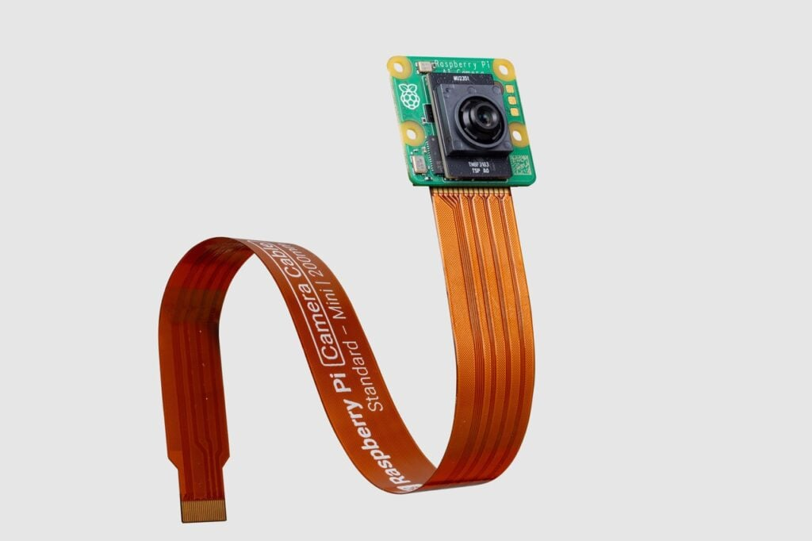

Là où le Kit AI Hailo est uniquement compatible avec la carte PI 5 , la caméra officielle Raspberry AI est utilisable sur l'ensemble de la gamme des cartes, y compris la Raspberry PI Zero.<br>
Cette caméra embarque un capteur Sony IMX500 de 12 millions de pixel avec une vision à 78 degrés et également le mico-contrôleur RP2040 ( oui ! le même que sur sur le Raspberry PICO !) pour la gestion du réseau de neurone et du firmware.<br>

La suite logiciel d'IA de Sony permet de mettre en œuvre les réseaux de neurones de type TensorFlow ou PyTorch après conversion et chargement dans la flash de la caméra.


_Pour bien démarrer :_<br>
> https://www.raspberrypi.com/documentation/accessories/ai-camera.html<br>
> https://github.com/raspberrypi/imx500-models<br>


---

### En Octobre 2024 - le Raspberry Pi AI HAT+

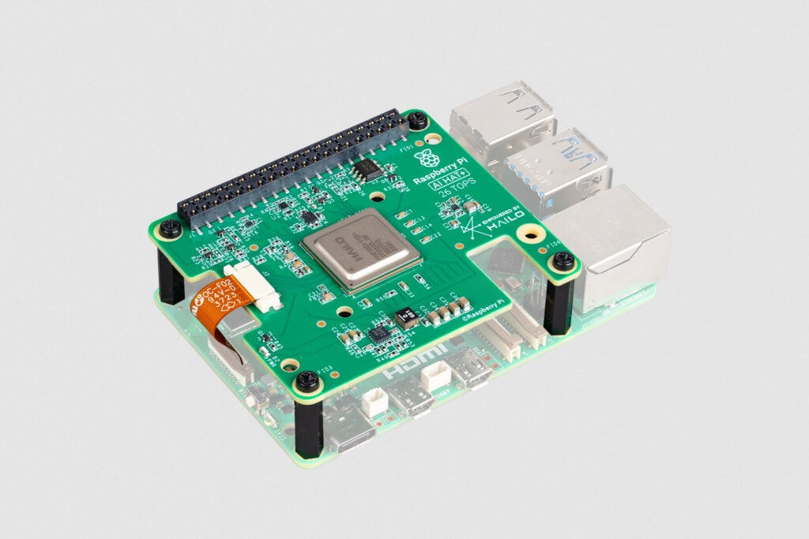

Cette fois ci, l'accélérateur Hailo AI n'est plus au format d'une carte M2 !<br>
C'est bien une carte d’extension pour Raspberry PI5 : un module HAT, en deux versions : 
* le modèle 13 TOPS (téra-opérations par seconde), doté du même accélérateur Hailo-8L que le kit AI
* le modèle 26 TOPS, plus puissant ! équipé de l’accélérateur Hailo-8

Toujours raccordé au bus PCIe Gen 3.0

https://www.raspberrypi.com/products/ai-hat/

---

### Autres solutions AI 

Une autre solution, mais moins officielle, consiste à utiliser une carte d’extension de type **Hat uPCIty Lite** pour disposer d'un bus PCIe x4  sur son Raspberry PI.<br>

Ce Bus PCIe x4  permet en suite de connecter une carte de type **Alftel 12x PCI Express M.2 Carrier Board** ... qui dispose de **12 slots PCI Express M2 !!!** <br>

Nous pourions donc installer 12 modules Hailo-8L au format M2 !!! <br>

<a href="img/Hat_uPCIty_Lite.png">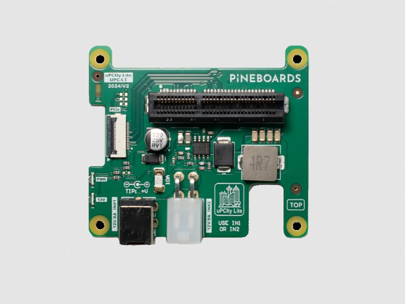</a>  <a href="img/m2-alftel-12x-pcie-m2-carrier-board.png">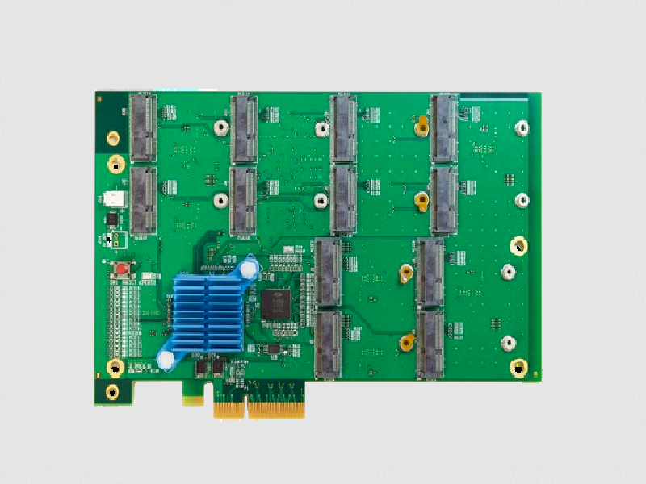</a>


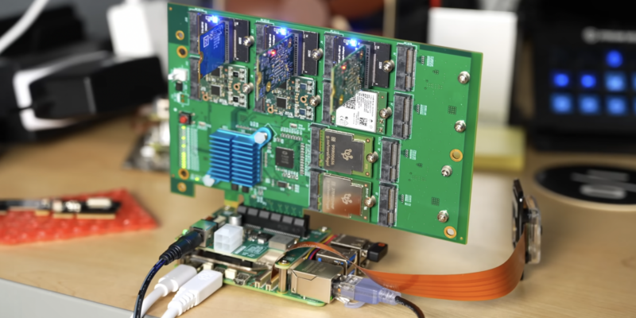<br> 

https://youtu.be/oFNKfMCGiqE

Mais puisque nous disposons d'un bus PCIe x4, il serait donc possible de plugger directement une carte graphique (GPU) type RTX xxxx sur le Hat uPCIty Lite  ... !!!<br>  
**Ok ! cette solution reste plutôt expérimentale ...!!**<br>


A noter également qu'il existe d'autres modules AI, comme par exemple le module Accélérateur Google Coral M.2 (A+E).<br>
Une solution économique doté du processeur Google Edge TPU capable d'atteindre une performance de 4 tera-opérations par seconde.<br>

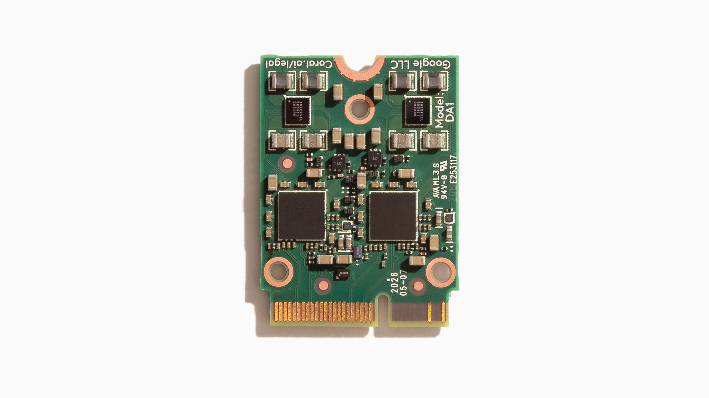


<br>
...mais nous nous éloignons un peu de notre sujet !<br>


---

# Partie 2 - Configuration rapide et tests des modules AI

Bon ! 
Pour bien démarrer, la première chose à faire est de suivre les instructions d'installation hardware et software sur le site officiel.

ici --> https://www.raspberrypi.com/documentation/accessories/ai-hat-plus.html<br>
et ici -->  https://www.raspberrypi.com/documentation/computers/ai.html

_Pour résumer très rapidement, voici les principales étapes de configuration :_

Mise à jour du système PI OS :

```bash
sudo apt update && sudo apt full-upgrade -y && sudo apt autoremove -y
```

Vérification de la version du micrologiciel (bootloader) du Raspberry Pi :
```bash
sudo rpi-eeprom-update 
```

pour utiliser la dernière version du bootloader : 
```bash
sudo raspi-config

		--> Advanced Options --> Bootloader Version --> Latest
		--> Finish  --> MAIS ne pas rebooter tout de suite ! 
```

mise à jour du micrologiciel (bootloader) du Raspberry Pi & reboot :
		
```bash
sudo rpi-eeprom-update -a 
sudo reboot 
```
	
en suite , pour forcer les vitesses Gen 3.0 (8 GT/s) du bus PCIe :<br>	
dans ```/boot/firmware/config.txt```
	
```bash
	dtparam=pciex1_gen=3
```

et enfin, installation des pilotes et utilitaires HAILO :

```bash
sudo apt install hailo-all 		
```

ce package à pour rôle d'installer les dépendances suivantes (janv2025):

```bash
	hailofw (>= 4.19.0), 
	hailort (>= 4.19.0), 
	hailo-tappas-core (>= 3.30.0), 
	rpicam-apps-hailo-postprocess (>= 1.5.3), 
	python3-hailort (>= 4.19.0)
```
	
Il est temps maintenant, de faire quelques vérifications
	
	
## Vérification de la présence du module AI

pour le Kit AI équipé du module **HAILO 8L** : 

```bash
$ hailortcli fw-control identify
	
		Executing on device: 0000:01:00.0
		Identifying board
		Control Protocol Version: 2
		Firmware Version: 4.19.0 (release,app,extended context switch buffer)
		Logger Version: 0
		Board Name: Hailo-8
		Device Architecture: HAILO8L
		Serial Number: HLDDLBB241602841
		Part Number: HM21LB1C2LAE
		Product Name: HAILO-8L AI ACC M.2 B+M KEY MODULE EXT TMP
```
ou, celon le cas,<br>
pour la carte AI Hat+ équipée du module **HAILO 8** : 
```bash
$ hailortcli fw-control identify

		Executing on device: 0000:01:00.0
		Identifying board
		Control Protocol Version: 2
		Firmware Version: 4.19.0 (release,app,extended context switch buffer)
		Logger Version: 0
		Board Name: Hailo-8
		Device Architecture: HAILO8
		Serial Number: <N/A>
		Part Number: <N/A>
		Product Name: <N/A>
```

## Vérification de la présence de la (ou des) camera(s) RPI

<a href="photos/IMG_3762.JPEG">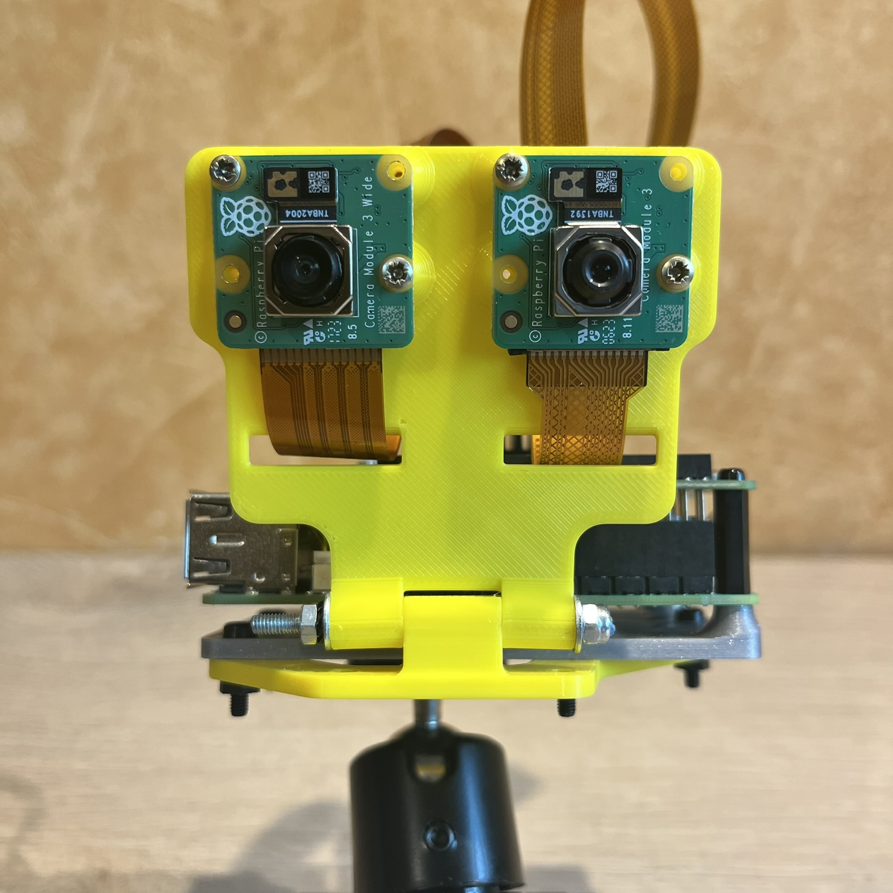</a> <a href="photos/IMG_3764.JPEG">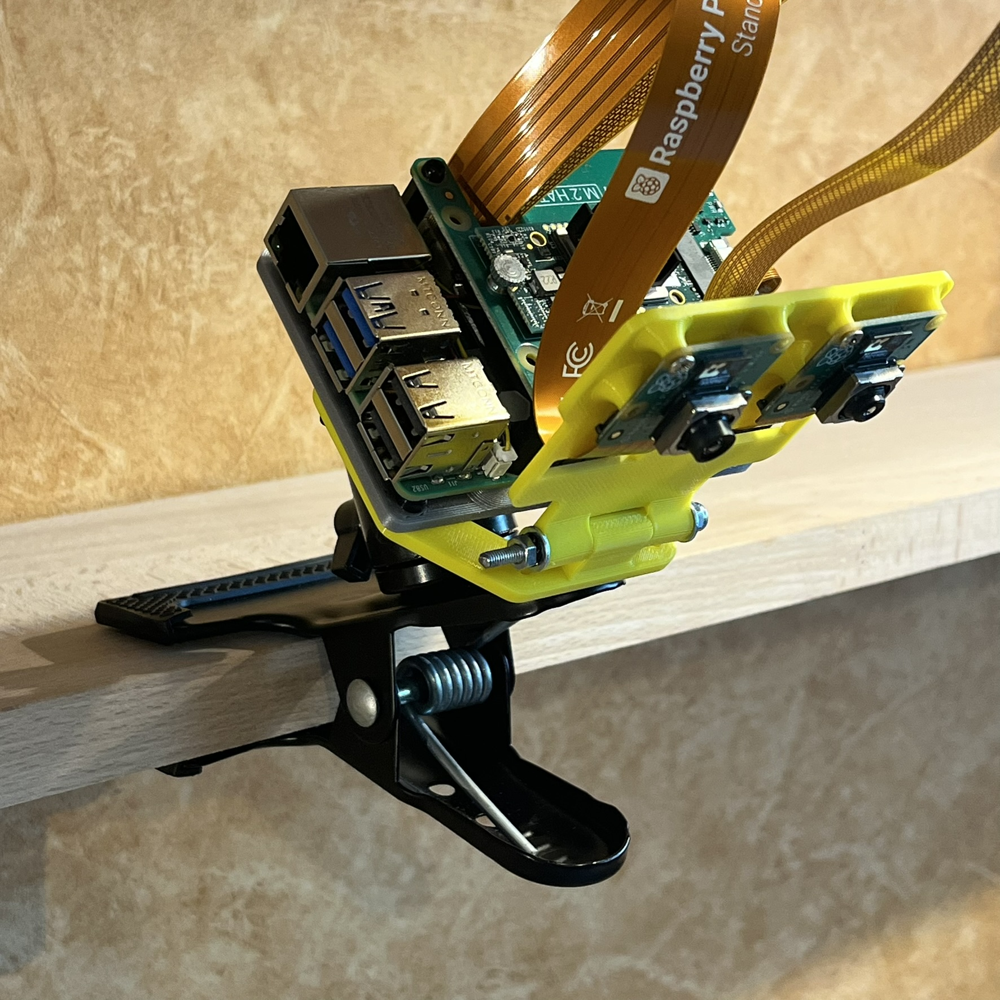</a> <a href="photos/IMG_3760.JPEG">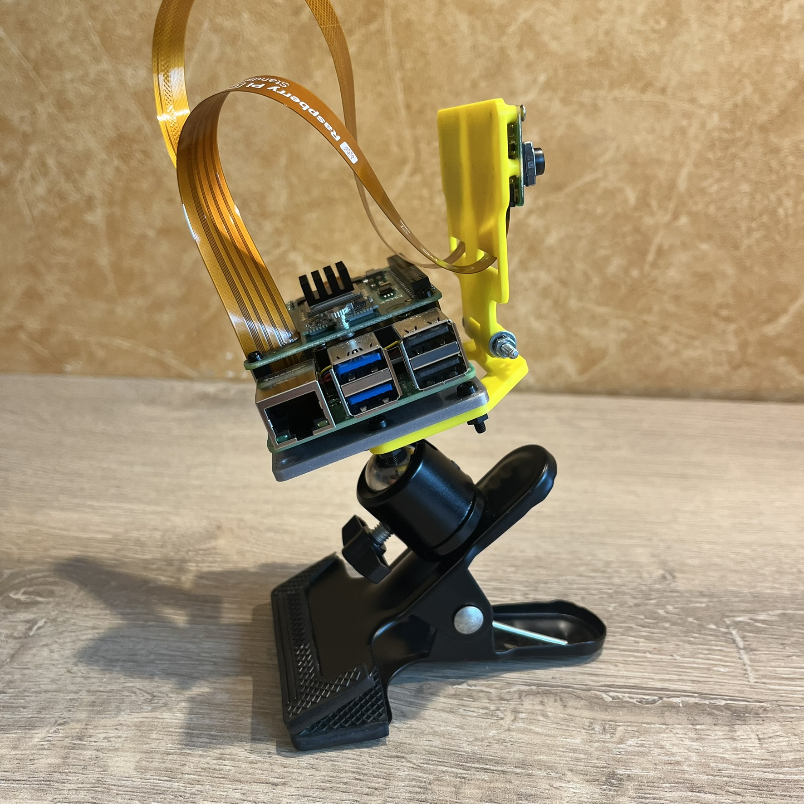</a>


Comme on peut le voir sur ces photos, j'ai équipé mon Raspberry PI de 2 cameras.<br>
Ceux sont deux cameras **module 3** équipées du capteur Quad Bayer IMX708 12MP.<br>
l'une en version standard avec un vision à 75 degrès,<br>
l'autre en version grand angle de 120 degrès<br>

```bash
$ rpicam-hello --list-camera

		Available cameras
		-----------------
		0 : imx708 [4608x2592 10-bit RGGB] (/base/axi/pcie@120000/rp1/i2c@88000/imx708@1a)
			Modes: 'SRGGB10_CSI2P' : 1536x864 [120.13 fps - (768, 432)/3072x1728 crop]
									 2304x1296 [56.03 fps - (0, 0)/4608x2592 crop]
									 4608x2592 [14.35 fps - (0, 0)/4608x2592 crop]

		1 : imx708_wide [4608x2592 10-bit RGGB] (/base/axi/pcie@120000/rp1/i2c@80000/imx708@1a)
			Modes: 'SRGGB10_CSI2P' : 1536x864 [120.13 fps - (768, 432)/3072x1728 crop]
									 2304x1296 [56.03 fps - (0, 0)/4608x2592 crop]
									 4608x2592 [14.35 fps - (0, 0)/4608x2592 crop]

```

Il est maintenant possible de tester, très simplement, le bon fonctionnement de la caméra : 

```bash
rpicam-hello -t 10s
``` 

Cette commande affiche l'image de vidéo de la première caméra durant 10 secondes, 
il bien évidement possible de sélectionner la caméra par son numéro d'index 

```bash
rpicam-hello -t 10s
```

```bash
rpicam-hello -t 10s --camera 0
rpicam-hello -t 10s --camera 1
```


## Tests de Détection, Segmentation, Estimation

la commande "**rpicam-hello**", complétée par la suite d'application "**rpicam-apps**" permettent de mettre rapidement mettre en œuvre la détection d'objets, la segmentation d'images , l'estimation de pose 

```bash
apt install rpicam-apps
	
rpicam-hello -t 0 --camera 1 --post-process-file /usr/share/rpi-camera-assets/hailo_yolov8_inference.json
```

<div style="text-align:center"></div>


D'autres tests sont décrits dans la documentation officielle du Raspberry PI :<br>
--> https://www.raspberrypi.com/documentation/computers/ai.html

---

Pour maintenant aller un peu plus loin,<br>
nous pouvons tester les exemples proposés par la société HAILO :

```bash
	git clone https://github.com/hailo-ai/hailo-rpi5-examples.git
	cd hailo-rpi5-examples
	./install.sh

	source setup_env.sh
```
puis, pour lancer l'exemple sur un vidéo :

```bash
python basic_pipelines/detection.py
```
ou, pour tester de puis la camera  :
```bash
	$ python basic_pipelines/detection.py --input rpi
```
		
_Références :_ 

https://github.com/hailo-ai/hailo-rpi5-examples<br>
https://github.com/hailo-ai/hailo-rpi5-examples/blob/main/README.md#installation<br>
	


---

# Partie 3 - Création de son propre réseau de neurones

Maintenant que tout est en place, nous pouvons rentrer dans le vif du sujet  !!!<br>

L'objectif est donc de :

* créer une IA de reconnaissance de formes simples
* sur la base de ses propres photos ( ou vidéos )
* et qui puisse exploiter la puissance d'un module IA d'un Raspberry PI5


Nous pouvons distinguer 4 grandes étapes décrites plus bas : 

* la création de son jeu de données, de son dataset
* l'entrainement du modèle IA
* la conversion, ou compilation, du modèle
* le déploiment et les tests    


_Archive du projet :_<br>
https://github.com/FredJ21/RPI5_AI_Hailo_tests


---

## 3.1 - Création de son jeu de donnée

Pour la création du Dataset, plusieurs méthodes se présente à nous : 
 
* Tout réaliser en local à l'aide d'outils spécifiques et/ou scripts Python 
* Utiliser la platforme *Roboflow*, en ligne, dans le cloud 

_remarque :_ il y a certainement d'autres méthodes ...


La création du dataset consiste à créer une collection d'images représentatives des objets que l'on souhaite détecter.<br> 
Ces images devront être annotés avec l'emplacement et le nom de l'objet<br>


Mais il quelques éléménets à prendre en considération 

* le format du dataset 

TODO

	YOLO (You Only Look Once)
	--> YOLOv8, comme ses prédécesseurs, fonctionne mieux avec des images de résolution carrée.
	--> 640x640 (par défaut pour YOLOv8) : Un bon compromis entre précision et performance. 

	--> arboressance des répertoires 
	--> le format des fichiers d'annotation 
	--> le nombre de classes
	--> les noms des classes


	Fred_Dataset/
	├── data.yaml
	├── test
	│   ├── images
	│   └── labels
	├── train
	│   ├── images
	│   └── labels
	└── valid
		├── images
		└── labels

70 / 15 / 15 


### 3.1.1 Création du Dataset en local 

J'ai réalisé de nombreux tests de création de dataset, avec 12 objets différents (12 classes),
différents fonds, plusieurs type d'éclairage ...  mais ca commencait à se compiquer un peu ... 
surtout quand le résultat attendu n'était pas au rendez vous .... 


Les fichiers sources, de mon derniers tests, son disponibles dans mon repo GitHub :

	https://github.com/FredJ21/RPI5_AI_Hailo_tests
	[GIT]RPI5_AI_Hailo_tests/Dataset/Fred_Dataset/images_HD_2

Ce Dataset est composé de 2 classes  :  "carré vert"  & "carré rouge"<br>

*Les photos :*

J'ai donc fait plein de photos de mes pièces en vaillant, bin évidement, à réaliser autant de photos pour chacune d'entre elle : 

- 150 photos pour le trainning  dans le repertoire *"train"*
- 30 photos pour la validation dans le repertoire *"valid"*
- 30 photos pour les tests dans le repertoire *"test"*

Pour réaliser ces photos, c'est très simple !  il suffit d'utiliser la camera du Raspberry ! <br>
Avec la commande suivante : 

```bash
rpicam-jpeg  --camera ${CAMERA} --output ${FILE} --timeout ${TIMEOUT} --autofocus-mode manual --lens-position 0.0
```
Cela produit une image haute définition de 4608x2592 pixels d'environ 3.3 Mo.

<a href="photos/1734219226.jpg">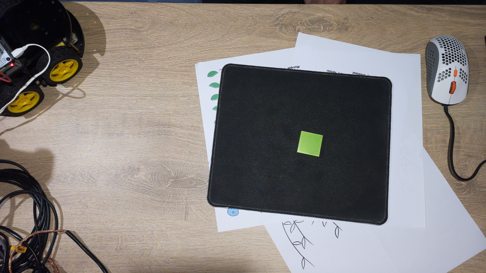</a>
<a href="photos/1734220832.jpg">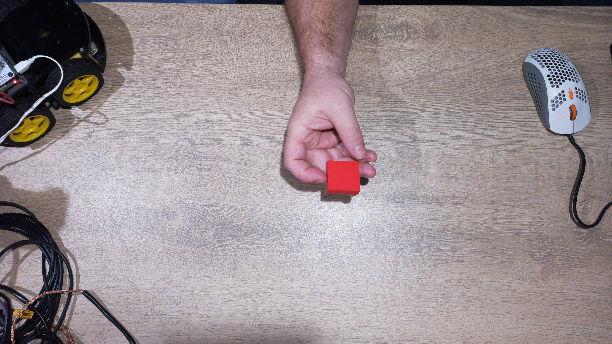</a>
<a href="photos/1734220572.jpg">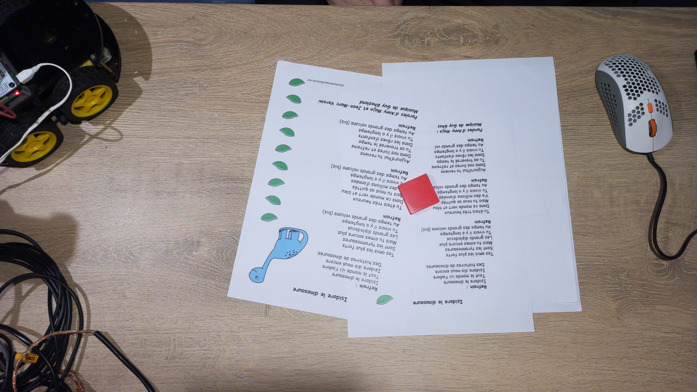</a>
<a href="photos/1734219623.jpg">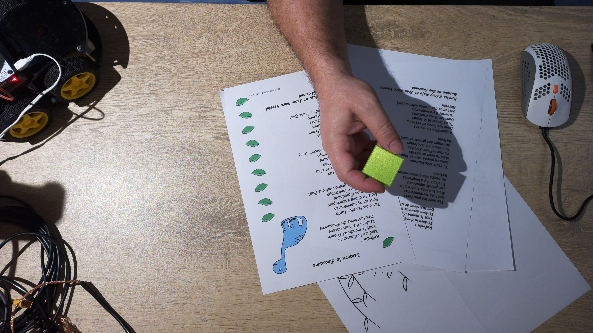</a>

Le script **"prendre_une_photo.sh"** ( dans le répertoire [GIT]RPI5_AI_Hailo_tests/Scripts/bin ) permet d'automatiser la séance 
en premant une photo toutes les 2 secondes et en répartissant les clichés des les repertoires : train, valid, et test.<br>
Le nom des fichiers correspond à un horodatage de type timestamp. 


*Les labels :*

Il est temps maintenant d'annoter les images.<br>
cette opération d'étiquetage consiste à dessiner un cadre de délimitation autour des objets présents sur les photos, tout en précisant sa classe ( "carré vert" ou "carré rouge" ) ?<br>

Cette opération nécessite une certaine précision et un peu de patience !!!<br>
Le cadres doit etre serré mmais pas trop proche. Il ne doit pas y avoir de surajustement dans le cas ou plusieurs objets sont présents sur la même photo.

Dans mon cas, j'ai choisi de réaliser des photos distinctes par type d'objet. J'ai donc qu'un seul objet par photo. 

Je souhaitais également réaliser cette opération complètement en local, sur mon Raspberry PI5, à l'aide d'un utilistaire très léger.<br>
J'ai donc utilisé **"YOLO-Label"** que l'on peut trouver sur le dépot du projet : 

	https://github.com/developer0hye/Yolo_Label

et également dispo sur mon GiHub, dans une verions pré-compilé pour le Raspberry PI en version Debian/PiOS 12 (bookworm)  

```bash
cd RPI5_AI_Hailo_tests//Scripts/bin/Yolo_Label/
chmod +x YoloLabel
./YoloLabel
```


*(annimation d'exemple du site officiel)*


L'utilisation est très simple et doit être réalisé sur l'ensemble des photos de DataSet.<br>
Tous les fichiers jpeg sont maintenant accompagnés par un fichier text du même nom mais avec l'extention .txt .   

	1734219226.jpg	-->  1734219226.txt
	1734220832.jpg  -->  1734220832.txt
	1734220572.jpg  -->  1734220572.txt
	1734219623.jpg  -->  1734219623.txt

Ces fichiers contiennent 5 valeurs numérique :
* l'index de la classe d'objet (0->carré route, 1->carré vert) et les 
* la position en X du centre de l’objet
* la position en Y du centre de l’objet
* la largeur de l’objet 
* la hauteur de l’objet

Les coordonnées sont normalisées de 0 à 1

*Augementation du nombre d'image*

Nous avons donc maintenant : 150 photos d'entrainement, 30 photos de validation, et 30 photos de test <br>   
au format 4608x2592 pixels.<br>
Chaque photo est acompagné de son fichier lablel 


```bash
$ cat train/1734219226.txt 

1 0.637242 0.526384 0.053579 0.094291
```


----


Script dans RPI5_AI_Hailo_tests/Scripts/bin

	dataset_HD_to_640x640_v2.py
	dataset_HD_to_640x640_v2.conf

TODO : à vérifier


### 3.1.2 Création du Dataset sur Roboflow


---

## 3.2 - Entraînement du modèle IA

2 solutions :  entraîner le modèle en local sous linux,  ou sur Google Colab


Mon Google Colab ( sur mon drive ): 
https://colab.research.google.com/drive/12KGsKCOmMf-tXJuz5a4KUEhlx-oW8yZv#scrollTo=A2VZRmI8cRbh

Le document Colab doit se connecter à un environnement d'execution avec GPU 

Todo : différent environnement !

il est possible de ce type d'environnement ne soit pas disponible à cause de limitation d'utilisation de Colab.
il est également possible du subir des déconnections qui engendrons la perte de son travail  .... 

imaginez !  vous lancez le traitement principal d’entraînement de votre nouveau modèle d'IA ... celui ci dure plusieurs heures et vous êtes donc parti faire un tour ...  
tous s'est bien passé !  nickel ! mais là , à la fin du traitement l'environnement d'execution ne détecte plus d'activité et déconnecte la session en cours !!!  
... il sera alors très probable de ne plus retrouver son travail lors de la reconnexion !    


La version payante permet de garantir une disponibilité des GPU dans le cloud Google. 

Mais une autre solution consiste à se connecter à un environnement d’exécution local . 
Pour cela , Google proposes une image docker très simple à mettre en œuvre :
les étapes : 

	- Installation de Docker sur son poste 
	
	--shm-size
	
	The Docker container’s shared memory (shm-size) can be modified to suit our application’s requirements. By default, the shm-size is set to 64 MB, but we can change it to a different value as needed.
	
	
	
	- $ docker run --gpus=all -p 127.0.0.1:9000:8080 --shm-size=2gb  europe-docker.pkg.dev/colab-images/public/runtime
	
	- puis dans le document Colab --> "connexion à un environnement d’exécution local" 

		"http://127.0.0.1:9000/?token=…
http://127.0.0.1:9000/?token=05f804ed9df704084e2081ba86881ad50d6358cc220cbd9e

---

## 3.3 - Conversion du modèle

Le plus simple est de faire sous linux 

	# pour DFC de Hailo 

	https://hailo.ai/developer-zone/documentation/hailo-sw-suite-2025-01/
	https://hailo.ai/developer-zone/software-downloads/


	
	$ unzip hailo_ai_sw_suite_2025-01_docker.zip
	$ ./hailo_ai_sw_suite_docker_run.sh
	
	
	plusieurs giga de dépendances lors du premier lancement 
	
Loading Docker image: /home/fredj21/FRED/hailo_ai_sw_suite_2025-01.tar.gz
INFO: Checking system requirements...
INFO: System requirements check finished successfully.
5baeb41057c7: Loading layer [==================================================>]  976.4MB/976.4MB
c361101a082c: Loading layer [==================================================>]   83.5MB/83.5MB
593a1325c5ed: Loading layer [==================================================>]  12.99MB/12.99MB
69b082334a83: Loading layer [==================================================>]  9.197MB/9.197MB
b2e1817da5c2: Loading layer [==================================================>]    384MB/384MB
71cf924c7ef0: Loading layer [==================================================>]  18.03MB/18.03MB
21f476235018: Loading layer [==================================================>]  3.072kB/3.072kB
11c4c6ec7d5d: Loading layer [==================================================>]  3.072kB/3.072kB
4b7ec45684e6: Loading layer [==================================================>]  3.072kB/3.072kB
9661444da425: Loading layer [==================================================>]  194.9MB/194.9MB
bba85803bb3e: Loading layer [==================================================>]  3.284GB/3.284GB
64951b6189b1: Loading layer [==================================================>]  485.1MB/485.1MB
92b2d02a49ee: Loading layer [==================================================>]  2.184GB/2.184GB
88eb41c2be66: Loading layer [==================================================>]  5.324GB/5.324GB
b3d3a14740d8: Loading layer [==================================================>]  895.5kB/895.5kB
2053f733bc05: Loading layer [==================================================>]  192.6MB/192.6MB
5f70bf18a086: Loading layer [==================================================>]  1.024kB/1.024kB
Loaded image: hailo_ai_sw_suite_2025-01:1	
	
	
		
	
	# autres options  :

		./hailo_ai_sw_suite_docker_run.sh
		./hailo_ai_sw_suite_docker_run.sh --help
		./hailo_ai_sw_suite_docker_run.sh --resume
		./hailo_ai_sw_suite_docker_run.sh --override


	Dans le docker Hailo :
	
		Welcome to Hailo AI Software Suite Container
		To list available commands, please type:	

		----------------------------------------------------

		HailoRT:                hailortcli -h
		Dataflow Compiler:      hailo -h
		Hailo Model Zoo:        hailomz -h
		TAPPAS:                 hailo_run_app -h

		----------------------------------------------------
	
	$ pip list | grep hailo
		hailo-dataflow-compiler      3.30.0
		hailo-model-zoo              2.14.0      /local/workspace/hailo_model_zoo
		hailo-tappas-dot-visualizer  3.31.0      /local/workspace/tappas/tools/trace_analyzer/dot_visualizer
		hailo-tappas-run-apps        3.31.0      /local/workspace/tappas/tools/run_app
		hailort                      4.20.0

	
	
		hailo -h
		
	Répertoire mappé avec le docker Hailo : 
			sour linux hote                                 Docker Hailo   
			/home.fredj21/FRED/shared_with_docker    -->    /local/shared_with_docker/


	je vais donc dans le répertoire de partage dans lequel un repertoire de travail , avec la date du jour, contient mon fichier onnx et les images de test de mon dataset 
	
	cp RPI5_AI_Hailo_tests/Results/20250125_result_from_210125_4_shapes_TEST.v3i.yolov8/weights/best.onnx shared_with_docker
	cp -rv RPI5_AI_Hailo_tests/Dataset/210125_4_shapes_TEST.v3i.yolov8/test   shared_with_docker
	cp -rv RPI5_AI_Hailo_tests/Dataset/210125_4_shapes_TEST.v3i.yolov8/valid  shared_with_docker
	cp -rv RPI5_AI_Hailo_tests/Dataset/210125_4_shapes_TEST.v3i.yolov8/train  shared_with_docker
	
	
	$ ./hailo_ai_sw_suite_docker_run.sh --resume
	$ cd /local/shared_with_docker
	$ sudo chown -R hailo:ht  
	$ cd 20250126 
	
	
	
	
	Architecture hailo8 ou hailo8l   !!! 
	
	
	$ hailomz compile yolov8s --ckpt=best.onnx --hw-arch hailo8 --calib-path test/images/ --classes 4 --performance


	TODO : 
		- tester avec les images de calibration du dataset
		- compiler pour hailo8l 	

	
	
	
	
	


---

## 3.4 - Déploiement et tests


	dans :
	~/FRED/GIT_RPI5_AI_Hailo_tests/Results/20250125_result_from_210125_4_shapes_TEST.v3i.yolov8/weights/Hailo_Compile
	
	Nous créons un fichier de définition des étiquettes : 
	
	my-labels.json


{
    "detection_threshold": 0.5,
    "max_boxes":200,
    "labels": [
      "unlabeled",
      "hexagon",
      "round",
	  "square",
	  "triangle"
    ]
}


on reprend le test plus haut  : 

	$ cd hailo-rpi5-examples
	$ source setup_env.sh

	
	mais, au lieu de lancer cette commande : 
	$ python basic_pipelines/detection.py
	
	
	nous spécifier le chemin vers notre IA et le fichiers de définition des étiquettes 
	dans mon cas :
	
	MY_HEF=/home/pi/FRED/GIT_RPI5_AI_Hailo_tests/Results/20250125_result_from_210125_4_shapes_TEST.v3i.yolov8/weights/Hailo_Compile/yolov8s.hef
	MY_LABELS=/home/pi/FRED/GIT_RPI5_AI_Hailo_tests/Results/20250125_result_from_210125_4_shapes_TEST.v3i.yolov8/weights/Hailo_Compile/my-labels.json
	
	
	python3 basic_pipelines/detection.py --hef-path $MY_HEF --labels-json $MY_LABELS --input rpi --camera 0
	


---
---
---


##
Documentation officielle Raspberry PI :
https://www.raspberrypi.com/documentation/computers/ai.html

##

Généralement, nous n'avons pas besoin de former son propre IA, car il existe une large gamme de modèle prè-formés pour les la gammes des accélérateurs Hailo : 

https://github.com/hailo-ai/hailo_model_zoo/tree/master/docs/public_models/HAILO8L
https://github.com/hailo-ai/hailo_model_zoo/tree/master/docs/public_models/HAILO8


