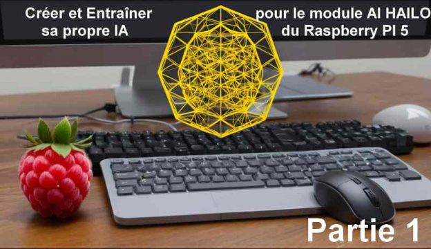
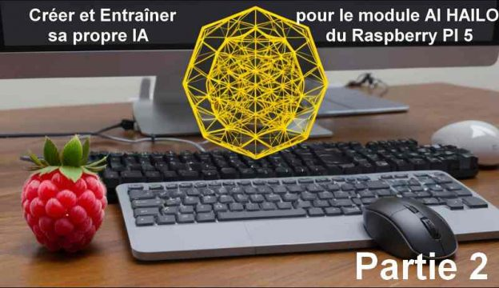
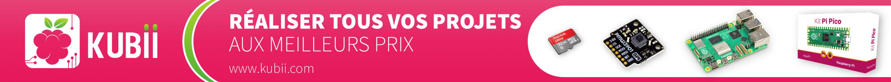

## Créer et Entraîner son propre IA pour le module AI HAILO du Raspberry PI 5 [Partie 1]

Voici le début d'une série d'articles consacrée à la mise en œuvre d'une intelligence artificielle embarquée sur un Raspberry Pi 5.

Le Raspberry Pi 5 est équipé d'une caméra ainsi que du module IA HAILO 8 et de son accélérateur de réseau neuronal intégré.

L'objectif est de démontrer comment l’IA est capable de reconnaître des objets spécifiques et personnalisés, en temps réel, dans un flux vidéo, et avec une consommation très faible des ressources CPU du PI5 

Cette série d’articles décrit les grandes étapes suivantes :
 
* la réalisation de son jeu de donnée à partir de ses propres photos et/ou vidéos 
* l’apprentissage du réseau de neurones avec les outils YOLOv8
* la compilation et le déploiement du modèle sur la puce HAILO8 du Raspberry PI

---

Le premier article d'une série de 3, par Fred Robotic , vice-président de l'association de robotique [CALIBAN](https://caliban-asso.fr/). Il vous propose de créer et entraîner votre propre IA pour le module [HAILO](https://www.raspberrypi.com/products/ai-hat/) du Raspberry Pi 5. 

 C'est à lire sur **Framboise 314 .fr** 
 
 https://www.framboise314.fr/creer-et-entrainer-son-propre-ia-pour-le-module-ai-hailo-du-raspberry-pi-5-partie-1

---

Suite de la série d'articles consacrée à la mise en œuvre d'une intelligence artificielle embarquée sur un Raspberry Pi 5.
Dans cet épisode, on lance l’apprentissage du réseau de neurones avec les outils YOLOv8 et la compilation du modèle pour la puce d’accélération HAILO8. 

Prérequis : une machine puissante équipée d’un puissant processeur graphique (GPU) 

 C'est à lire sur **Framboise 314 .fr** 

https://www.framboise314.fr/creer-et-entrainer-son-propre-ia-pour-le-module-ai-hailo-du-raspberry-pi-5-partie-2

---

Un grand merci à toute l'équipe **Kubii.fr**, pour la fourniture du matériel qui a permis de réaliser toutes ces expériences, et en particulier pour le module d’Intelligence artificielle Hailo, indispensable dans ce développement. 
[www.kubii.fr](https://www.kubii.fr), distributeur officiel des produits Raspberry Pi et Micro:Bit en France.

